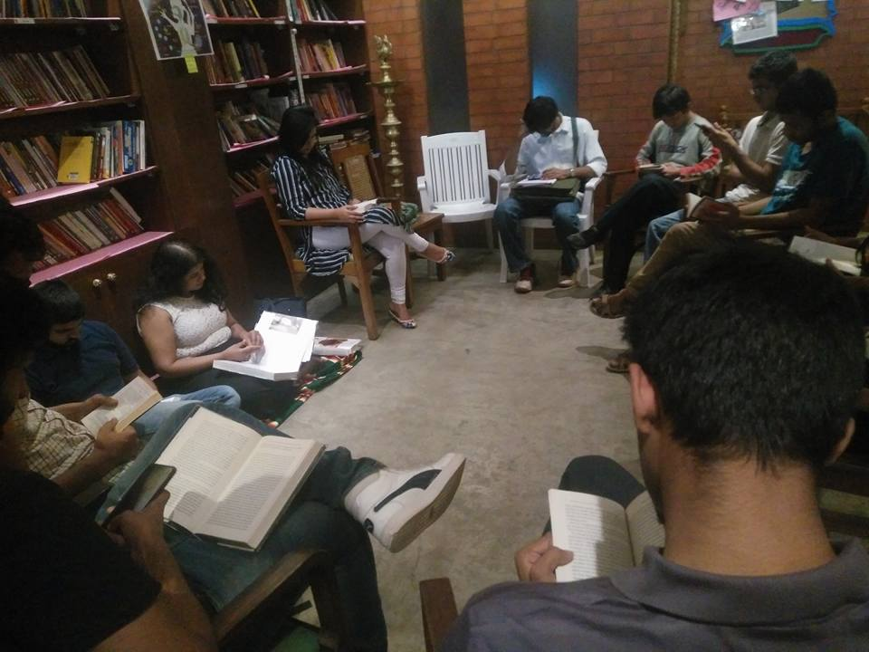
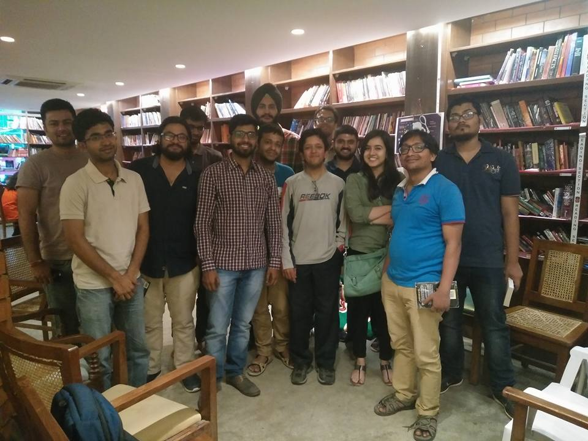

This was the first Official meetup. Radhika and I had a better understanding of who had RSVP-ed and what time folks would start spilling in etc. We decided to pick Atta Galatta because Radhika (henceforth denoted as Pup) had heard a lot of good things. We met with Palgun, the manager at Atta Galatta (a beloved friend and a quintessential BBB member now, but a relative stranger at the time), who didn't really know what was coming, but accomodated us nonetheless at 3 PM on Apr 16 2017. 
Pup and I didn't have an agenda at the time, but from what we'd heard from how other Bookclubs worked, we'd sit and read the books we'd brought with us in silence. This didn't work out too well for more than 20 minutes because we are a restless generation. Hmph.
And thus began the tradition of going around in a circle discussing the books we've read over the month.



<noscript>Please enable JavaScript to view the <a href="https://disqus.com/?ref_noscript">comments powered by Disqus.</a></noscript>
                            

