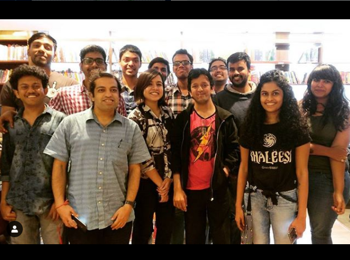

So yesterday, we had meetup #4! :) And the usual gang had gathered along with a couple of new faces.
We spoke about this and that and books and yes, we ate a lot. 
(I'm so good at summarizing)
But, the real takeaway was the collective knowledge of the books we might not have read that we individually and separately had. And we've made a list of those books this time :)

These are the books that our attendees had read over the last month or were reading and each of them had only good things to say about them -

- Nine Lives -  https://www.goodreads.com/book/show/6943146-nine-lives
- Before we visit the Goddess - https://www.goodreads.com/…/25814315-before-we-visit-the-go…
- English August - https://www.goodreads.com/book/show/75703.English_August
- The lIberation of Sita -  https://www.goodreads.com/book/show/31680189-the-liberation-of-sita
- The Shadow Throne - https://www.goodreads.com/book/show/15755005-the-shadow-throne
- An association of small bombs - https://www.goodreads.com/book/show/25810398-the-association-of-small-bombs
- The Dark Tower - https://www.goodreads.com/series/40750-the-dark-tower
- Askew - https://www.goodreads.com/book/show/32601647-askew
- Tamil - https://www.goodreads.com/book/show/29940795-tamil
- The Sellout - https://www.goodreads.com/book/show/22237161-the-sellout
- Cuckold - https://www.goodreads.com/book/show/109326.Cuckold
- American Gods - https://www.goodreads.com/book/show/30165203-american-gods
- The Night Circus - https://www.goodreads.com/book/show/9361589-the-night-circus
- The Wealth of Nations -  https://www.goodreads.com/book/show/115596.The_Wealth_of_Nations_Books_1_3
- Elon Musk - https://www.goodreads.com/book/show/22543496-elon-musk

After this, a couple of us went to Bookworm and Blossoms and got ourselves a humble haul of books.



<noscript>Please enable JavaScript to view the <a href="https://disqus.com/?ref_noscript">comments powered by Disqus.</a></noscript>
                            
