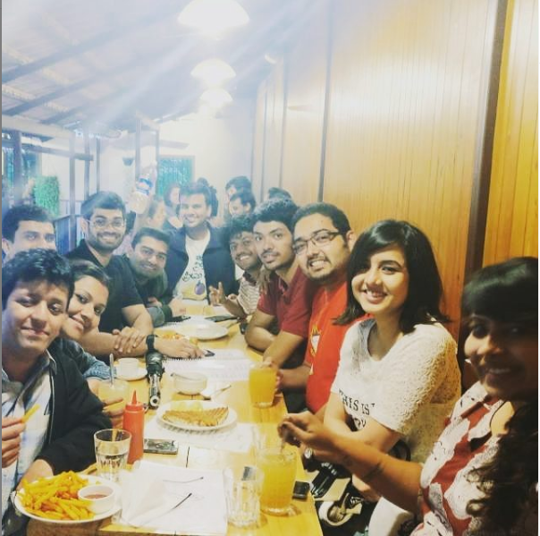

Aaaand Meetup#5 happened as well ! :) The modest strength of the attendees notwithstanding, this was another fun meet. We had 3 new entrants today in Gokul S Nath, Amay Narayan and Palgun Kj . Also, pseudo-newbie Varun Vasudev finally made it to His first formal book-meetup as well :D 

The books mentioned and discussed today were -

1) Eleanor & Park by Rainbow Rowell
https://www.goodreads.com/book/show/15745753-eleanor-park

2) The Ruby in the Smoke (Sally Lockhart, #1) by Philip Pullman
https://www.goodreads.com/…/sh…/114982.The_Ruby_in_the_Smoke

3) The Final Empire (Mistborn, #1) by Brandon Sanderson 
https://www.goodreads.com/book/show/68428.The_Final_Empire

4) Storm Born (Dark Swan #1) by Richelle Mead
https://www.goodreads.com/book/show/2754510-storm-born

5) The Dresden Files Series by Jim Butcher
https://www.goodreads.com/series/40346-the-dresden-files

6) Neverwhere by Neil Gaiman 
https://www.goodreads.com/book/show/14497.Neverwhere

7) Shades of Darkness (Ravenborn #1) by A.R. Kahler
https://www.goodreads.com/…/show/25390583-shades-of-darkness

8) The Kingkiller Chronicle Series by Patrick Rothfuss
https://www.goodreads.com/se…/45262-the-kingkiller-chronicle

9) City of Djinns: A Year in Delhi by William Dalrymple
https://www.goodreads.com/book/show/124430.City_of_Djinns

10) Ghachar Ghochar by Vivek Shanbhag
https://www.goodreads.com/book/show/30267604-ghachar-ghochar

11) Purple Hibiscus by Chimamanda Ngozi Adichie 
https://www.goodreads.com/book/show/126381.Purple_Hibiscus

12) Hot Tea Across India by Rishad Saam Mehta 
https://www.goodreads.com/…/s…/13149984-hot-tea-across-india

13) Throne of Glass Series by Sarah J. Maas 
https://www.goodreads.com/series/51288-throne-of-glass

14) Quantum: Einstein, Bohr and the Great Debate About the Nature of Reality by Manjit Kumar 
https://www.goodreads.com/book/show/6448772-quantum

15) Americanah by Chimamanda Ngozi Adichie
https://www.goodreads.com/book/show/15796700-americanah

16) Capital: The Eruption of Delhi by Rana Dasgupta
https://www.goodreads.com/book/show/18693636-capital

17) Empire of Cotton: A Global History by Sven Beckert 
https://www.goodreads.com/bo…/show/20758057-empire-of-cotton

18) 11/22/63 by Stephen King 
https://www.goodreads.com/book/show/10644930-11-22-63

19) A Man Called Ove by Fredrik Backman
https://www.goodreads.com/bo…/show/18774964-a-man-called-ove

20) Shibumi by Trevanian 
https://www.goodreads.com/book/show/1059.Shibumi

21) We Should All Be Feminists by Chimamanda Ngozi Adichie
https://www.goodreads.com/…/22738563-we-should-all-be-femin…

22) Aristotle and Dante Discover the Secrets of the Universe by Benjamin Alire Sáenz 
https://www.goodreads.com/…/12000020-aristotle-and-dante-di…

23) Robot Series by Isaac Asimov
https://www.goodreads.com/series/49175-robot

24) IT by Stephen King

25) The Wheel of Time Series by Robert Jordan
https://www.goodreads.com/series/41526-the-wheel-of-time

26) Sapiens: A Brief History of Humankind by Yuval Noah Harari
https://www.goodreads.com/book/show/23692271-sapiens

27) The Way of Kings (The Stormlight Archive #1)
by Brandon Sanderson 
https://www.goodreads.com/book/show/7235533-the-way-of-kings

28) The Blaft Anthology of Tamil Pulp Fiction, Vol. I by Rakesh Khanna 
https://www.goodreads.com/…/3407674-the-blaft-anthology-of-…

29) The Mahabharata Murders by Arnab Ray 
https://www.goodreads.com/…/30058494-the-mahabharata-murders

30) India vs Pakistan: Why Can't We Just Be Friends? by Husain Haqqani
https://www.goodreads.com/b…/show/30232415-india-vs-pakistan

31) The Adivasi Will Not Dance by Hansda Sowvendra Shekar 
https://www.goodreads.com/…/27240055-the-adivasi-will-not-d…

32) The Pregnant King by Devdutt Pattanaik 
https://www.goodreads.com/bo…/show/3086194-the-pregnant-king

33) Shikhandi and Other Stories They Don't Tell You by Devdutt Pattanaik
https://www.goodreads.com/…/22697803-shikhandi-and-other-st…

34) Sputnik Sweetheart by Haruki Murakami 
https://www.goodreads.com/book/show/9557.Sputnik_Sweetheart

35) Exit West by Mohsin Hamid 
https://www.goodreads.com/book/show/30688435-exit-west

36) Malazan Book of the Fallen Series by Steven Erikson
https://www.goodreads.com/…/43493-malazan-book-of-the-fallen

37) Shoe Dog: A Memoir by the Creator of NIKE by Phil Knight
https://www.goodreads.com/book/show/27220736-shoe-dog

38) The Fry Chronicles 
https://www.goodreads.com/b…/show/8649656-the-fry-chronicles

39) City Adrift : A Short Biography of Bombay by Naresh Fernandes 
https://www.goodreads.com/book/show/18740766-city-adrift

40) Narcopolis by Jeet Thayil 
https://www.goodreads.com/book/show/12384322-narcopolis

41) Serious Men by Manu Joseph 
https://www.goodreads.com/book/show/7628608-serious-men

42) The Illicit Happiness of Other People by Manu Joseph 
https://www.goodreads.com/…/13707645-the-illicit-happiness-…

:D This was quite the list to compile and as I was listing them out I felt a twinge of guilt at not having recognised close to half of the books :) I'm sure you will too. Pick up a book today! :D

Oh and we wound down the meetup by running across the road from Atta Galatta to Dyu Art Cafe where we wolfed down some good eatables.

Another good meetup :) Thank you, those of you who could make it!

Hope to see some of the rest of you next time :)

PS - A hat tip to Aarzu Sadana for yet again noting down the names of the books and making life a little bit easier for me



<noscript>Please enable JavaScript to view the <a href="https://disqus.com/?ref_noscript">comments powered by Disqus.</a></noscript>
                            

