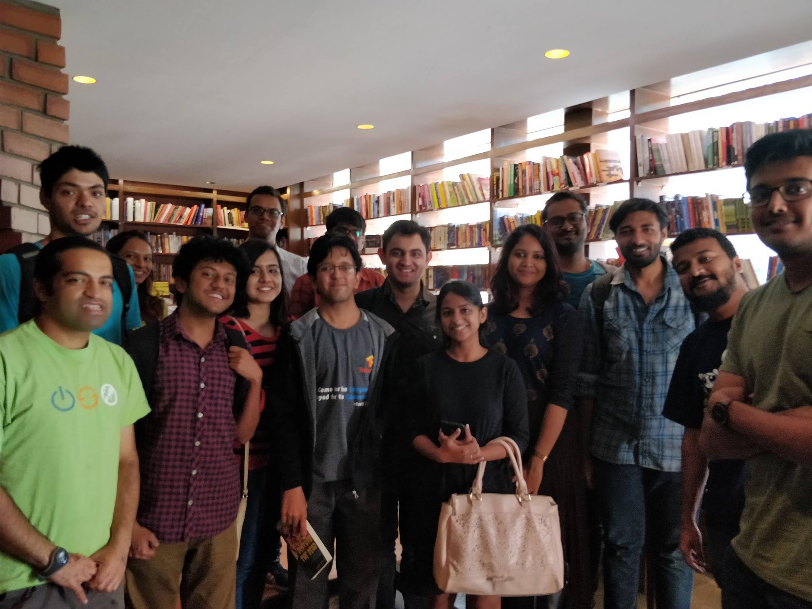

This was the first meetup of 2018 and if spirited conversations, a lot of laughter and smiles all around are any indication, it was a lot of fun. We had a modest gathering of close to 25 people and everyone...came on time. (Fiine.. I wasn't there on time). We went with our usual practice of talking about the last couple of books we'd read and with the gathering that we had, a lot of books were discussed. We had a few new faces ( :) ) and some old heads were absent (-_-) .

Oh, and just in case you were wondering, we ordered a lot of coffee and masala fries and just 2 cheese omelettes. You know you were thinking about that.

PS - Aarzu Sadana was awesome enough to bring her dad along who was an absolute delight to interact with :) 

The following are the books that were discussed in the Jan 2018 meetup. 

-  Anna and the French Kiss – Stephanie Perkins 
-  Looking Away – Harsh Mander 
-  Wolves of the Calla (The Dark Tower #5) – Stephen King 
-  Red Rising – Pierce Brown 
-  There’s someone inside your house – Stephanie Perkins 
-  Arguably – Christopher Hitchens 
-  Sapiens – Yuval Noah Harari 
-  In the Shadow of the earth – JP Borders 
-  Steve Jobs – Walter Issacson 
-  Alex ferguson – Autobigraphy 
-  How to become a bawse – Lilly Singh 
-  I am Zlatan - Zlatan 
-  Ghachar Ghochar – Vivek Shanbhag 
-  1984 – George Orwell 
-  Turtles all the way – John Green 
-  A horse and two goats – R K Narayan 
-  Paper Towns – John Green 
-  Em and the big Hoom – Jerry Pinto 
-  The Peculiar Life of a lonely Postman - Denis Theriault 
-  The postman’s fiance – Denis Theriault 
-  The quantum Thief – Hannu Rajaniemi 
-  Origin – Dan Brown 
-  An ordinary life – Nawazuddin Siddiqui 
-  The Game – Neil Strauss 
-  The wind in the willows – Kenneth Grahame 
-  The vegetarian – Han Kang 
-  Men without women – Haruki Murakami 
-  Meditations – Marcus Aurelius 
-  How green was my valley - Richard Llewellyn 
-  Gujarat fights – Rana Ayyub 
-  From Godmen to Tycoon – Priyanka Pathak 
-  The God of small things – Arundhati Roy 
-  The summer requiem – Vikramn Seth 
-  The ministry of utmost happiness – Arundhati Roy 
-  Oathbringer – Brandon Sanderson 
-  The Alcatraz series – Brandon Sanderson 
-  The Cursed child 
-  Mistborn series – Brandon Sanderson 
-  The hunger games – Suzanne Collins 
-  The wind up bird chronicle – Haruki Murakami 
-  Why poetry – Matthew Zapruder 
-  The castle – Kafka 
-  The stranger – Albert camus 
-  Colorless Tsukuru Tazaki and His Years of Pilgrimage – Haruki Murakami 
-  In search of lost time – Marcel Proust 
-  Mothering the Muslim – Nazia Erum 
-  I could pee on that – Francesco Marciuliano 
-  The Martian
-  Milk and Honey – Rupi Kaur
-  Fangirl – Rainbow Rowell 
-  Consent to Kill – Mitch Rapp 
-  Geetanjali – Rabindranath Tagore
-  A thousand splendid suns – Khaled Hosseini
-  Screw it, let’s do it – Richard Branson 
-  Pillars of the Earth – Ken Follet 
-  Winter of the World – Ken Follet 
-  9 lives – William Dalrymple 
-  The Dresden Files – Jim Butcher 
-  The Gene – Siddhartha Mukherjee 
-  The boy who loved - Durjoy Dutta 



<noscript>Please enable JavaScript to view the <a href="https://disqus.com/?ref_noscript">comments powered by Disqus.</a></noscript>
                            
