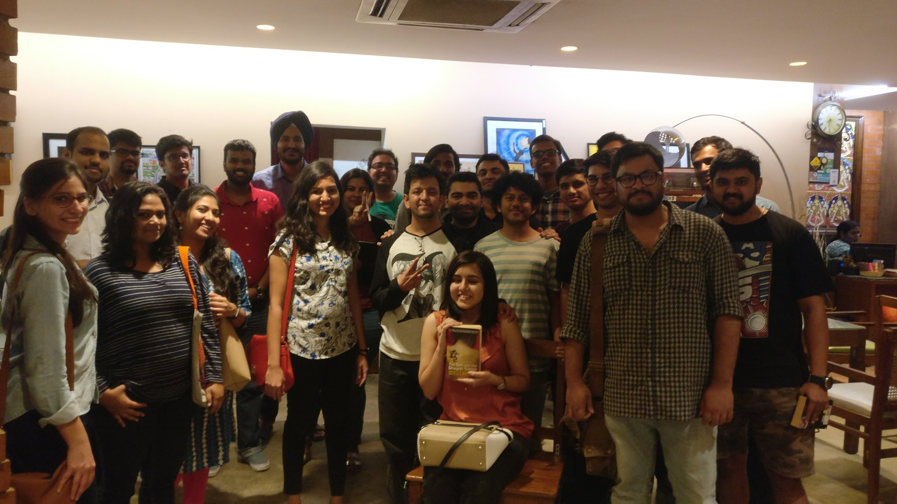

We at Broke Bibliophiles Bangalore had our 2nd meetup of 2018 and 9th meetup in all on Saturday, the 24th of Feb. 
It was a lot of fun, even the first half of it, I'm sure. I reached late ...coz..I started late. We had a lot more people join in this time and that fueled most of the conversation. 

Some of the books discussed were - 

- A Room of One's Own (by Virginia Woolf)
- Skin in the game (by Nassim Nicholas Taleb)
- Ready Player One
- The Elephant in the Brain (by Kevin Simler)

and a smattering of Murakami as always.

We also had Rahul Kondi join us this time with his typewriter. You're intrigued at the mention of a word you probably heard a decade ago. Yes, this boy sits at Church Street, in front of Blossoms every Saturday and types notes on his typewriter from 4 pm - 6 pm . I'm not sure if this counts as marketing but I should probably get a commission at this point......even If the whole thing is..you know.. free. 

Aaanyway, again, this was fun guys :) 



<noscript>Please enable JavaScript to view the <a href="https://disqus.com/?ref_noscript">comments powered by Disqus.</a></noscript>
                            
