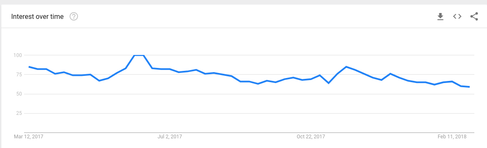
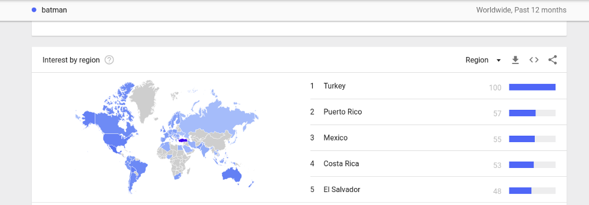

You’re probably aware of most of the products that Google offers. Trends, is one of them and it allows you to look up various trends of searches by time, country etc. It’s a lot of fun…if you’re into that sort of thing.

I was randomly searching for usages of English words on Google Trends (as one does) and as I went through words of no real significance — boat, silo etc, at one point paused and almost on a whim looked up “Batman” , juust to see if people search for knowledge about the caped crusader on a daily basis.

Turns out they did, for reasons I have not yet looked up -

As we can see, there’s a steady graph rising and falling unsurprisingly. There’s a weird spike during the Jul 11–17 period. But that’s not the point of this post.

I scrolled further down on the Trends page and came across the country stats section, and something here stood suspiciously out.

There has been some curiosity around the Americas and some in Australia, but what jumps out is the glaring number and deep intensity of blue on the chart from Turkey, of all places! I wondered why this was and it turns out there is a city named Batman in Turkey!!! Yes. I got excited as well. Surely a city named for (I thought) one of the best DC characters ever created has a whole bunch of Batman related things to see and do there?! Sadly, there isn’t. There isn’t even a correlation between the names. The city was renamed from its original name of Iluh to Batman purely for the river Batman that flowed through it. The river itself was named for a then-common unit of mass used by the Ottoman Empire in Turkey which was “batman” (Turkish pronunciation: [batˈman]).

So, there definitely is no connection… :( except for a lawsuit that was threatened to be filed by the Mayor of Batman against Warner Bros in 2008 after The Dark Knight was released, but nothing happened there.

Needless to say, this place has always been a topic of discussion among tourists, but I happened to chance upon this little nugget of information just today and I’m sure there are more things to glean from just simple searching and the intuitive that visualization offers .



<noscript>Please enable JavaScript to view the <a href="https://disqus.com/?ref_noscript">comments powered by Disqus.</a></noscript>
