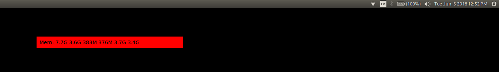

I use Ubuntu 16.04 and I've been searching for a good memory monitoring desktop widget to no avail. I found a couple of taskbar widgets but none that would tell me the free memory left in addition to the used/swap/cache memories. 

So I decided to write my own (with loads of help from the Internet of course).

### Component 1 — The widget

I didn't know how to do this. Thankfully [Stuart Langridge](https://www.kryogenix.org/days/2014/03/03/writing-a-simple-desktop-widget-for-ubuntu/) had already done this for me. I tweaked the ```override_background_color``` parameter to get a red background for my widget and the size of the widget itself to be ```400*20``` so it would be a nice small strip rather than a big blob of a rectangle.

### Component 2 — Memory tracking

As is common knowledge, one can find out the current memory status using ```free``` on Ubuntu. Going a little further, ```awk '/^Mem/ {print $4}' <(free -h)``` gives me just the 'Mem' row of the complete information. The values in this row are the Total memory, Used memory, Free memory, shared Memory, Cache memory and the Available memory respectively.
I'm personally concerned only with the amount of Free Memory but the rest of the information doesn't hurt. 


### Setup

- After you clone the repo, you'll have to create an empty file called ```memory.html``` in the same directory. 
- For now, the way I'm using these scripts is by running them in terminal in the background(&) 
I'm sure there are a lot of other ways to automate the entire process and run this - I'll look into them. I monitor it every 3 seconds. And no, the scripts themselves don't consume much memory :D 


### Result 

This is how it looks now : a very just-usable desktop widget. No frills. It gets updated every 3 seconds.



### To-Do

- Label the values
- Better UI
- Test and adapt this across other operating systems. Although I'm sure other OS' have their share of awesome widgets. 

### Source Code —
https://github.com/abhiramr/Everything_Python/tree/master/Random_Py_scripts/Desktop_Widgets/Memory%20Monitor


<div id="disqus_thread"></div>
<script>

/**
*  RECOMMENDED CONFIGURATION VARIABLES: EDIT AND UNCOMMENT THE SECTION BELOW TO INSERT DYNAMIC VALUES FROM YOUR PLATFORM OR CMS.
*  LEARN WHY DEFINING THESE VARIABLES IS IMPORTANT: https://disqus.com/admin/universalcode/#configuration-variables*/
/*
var disqus_config = function () {
this.page.url = abhiramr.github.io/2018-06-05-Memory-Monitor-Widget-Using-Python;  // Replace PAGE_URL with your page's canonical URL variable
this.page.identifier = 2018-06-05-Memory-Monitor-Widget-Using-Python; // Replace PAGE_IDENTIFIER with your page's unique identifier variable
};
*/
(function() { // DON'T EDIT BELOW THIS LINE
var d = document, s = d.createElement('script');
s.src = 'https://abhiramr.disqus.com/embed.js';
s.setAttribute('data-timestamp', +new Date());
(d.head || d.body).appendChild(s);
})();
</script>
<noscript>Please enable JavaScript to view the <a href="https://disqus.com/?ref_noscript">comments powered by Disqus.</a></noscript>
                            

