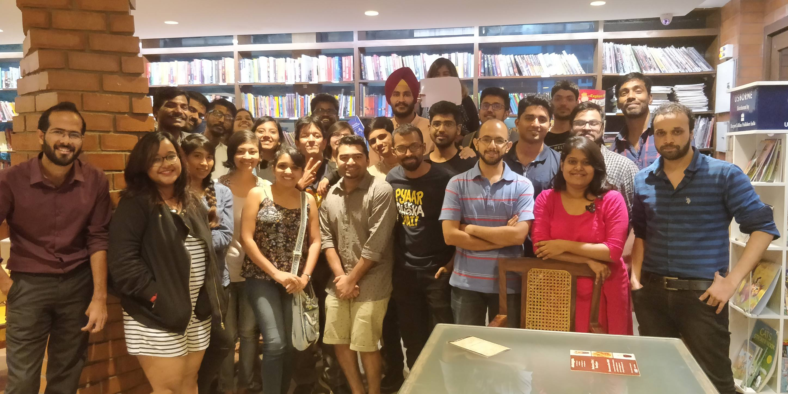

Oh yessss 🐣 Meetup #13 happened on 22 Apr 2018 and I was very pleased with the eventual turnout, one of the largest we've had so far.
This time we didn't have a theme and that was awesome since the discussion wasn't polarized or monopolized and everyone got their say. And these are the kind of meetups I'm personally preferential to, where everyone gets to voice their opinion about books they've read coz everyone's read Something even if it isn't related to a pre-set theme (not discounting the advantages of the themed meetups, of course. )
A couple of people who had no idea about BBB, tantalized by the amount of noise we were making no doubt, also joined the discussion and that added to the existing flavor, so... Double yay and stuff. ✌️😊
All in all, a good meetup.

The following are the books that were discussed in the Jun 2018 meetup. 

- The Dragon Reborn - WoT Robert Jordan
- The Burden of Democracy - Pratap Bhanu Mehta
- Mahabharatha Murders - Arnab Ray
- Barefoot to Boots - Novy Kapadia
- The Devotion of Suspect X - Kiego Higashino
- Midsummer’s Equation - Kiego Higashino
- Malice - Kiego Higashino
- Catcher in the Rye - JD Salinger
- Doomed - Chuck Palahniuk
- Survivor - Chuck Palahniuk
- Eleanor Oliphant Is Completely Fine - Gail Honeyman
- GoT - GRRM
- My Lover’s Lover - Maggie O’Farrell
- Granta
- Three Zeros - Mohammad Yunus 
- How To Win Friends and Influence People - Dale Carnegie
- A Thousand Splendid Suns - Khaled Hosseini
- Finding Audrey - Sophie Kinsella
- One Part Woman - Perumal Murugan
- The Existentialist Cafe - Sarah Baker
- Rational Optimist - Matt Ridley
- Fall - Camus
- Wonder - Rj Palacio
- Creativity Inc - Ed Catmull
- Forty Rules of Love - Eli Shafak
- Foundation - Isaac Asimov
- 2001 A Space Odyssey - Arthur C Clarke
- A Horse Walks into a Bar - David Grossman
- On the Road - Jack Kerouac
- Lincoln in the Bardo - George Saunders
- Sourdough - Robin Sloan
- The Rosie Project
- Immortal Life of Heneritta Lacks - Rebecca Skloot
- Five People who you meet in the heaven - Mitch Albom
- Sputnik Sweetheart - Haruki Murakami
- Norwegian Wood - Haruki Murakami
- Ministry of Utmost Happiness - Arundhati Roy
- Outliers - Malcolm Gladwell
- Sapiens - Yuval Noah Hariri
- Gene - Sidharth Mukherjee
- Skin in the Game - Nassim Nicholas Taleb
- Thinking Fast, Thinking Slow - Daniel Kahneman
- Fountainhead - Ayn Rand
- Think of A Number - John Verdon
- The Hate You Give - Angie Thomas
- The Handmaid’s Tale - Atwood
- Three stars shine down - Sidney Sheldon
- Antarmukham (Telugu)
- Shiva Trilogy - Amish
- City of Djinns - William Dalrymple
- Story of a Brief Marriage - Anuk Arudprasagam
- The Great Indian Novel - Shashi Tharoor
- The Color Purple - Alice Walker
- The Reluctant Fundamentalist - Mohsin Hamid
- Dr.Fisher from Geneva - Graham Reed
- Zen and the Art of Motorcycle Maintenance - Robert M Pirsig
- Return of the king: Battle for Afghanistan - William Dalrymple
- Blue Umbrella - Ruskin Bond
- The Illicit Happiness of other people - Manu Jospeh
- Seeking Wisdom - Peter Bevelin
- Made to Stick - Dan Heath
- Steve Jobs - Walter Isaacson
- Shoe Dog - Phil Knight
- Hooked - Nir Eyal
- The Diamond Age - Neal Stephenson
- Zero to One - Peter Thiel
- A Suitable Boy - Vikram Seth
- Witcher - The Last Witch 
- Neverwhere - Neil Gaiman
- Sacred Games - Vikram Chandra
- Norse Mythology - Gaiman
- Children of Time - Adrian Tchiakovsky
- Flowers of Algernon - Daniel Keyes
- Poonachi - Perumal Murugan
- The Trial - Kafka
- Expanse Novellas - James S. A.Corsey
- The Count of Monte Cristo - Alexandre Dumas
- HP1
- Ender’s Game - Orson Scott Card
- Lean In - Sheryl Sandberg
- Sandman - Gaiman
- Sabriel - Garth Nix
- Dilbert’s Principle - Scott Adams
- Interrogation of my Chandal Life - Manoranjan Byapari 



<noscript>Please enable JavaScript to view the <a href="https://disqus.com/?ref_noscript">comments powered by Disqus.</a></noscript>
                            
