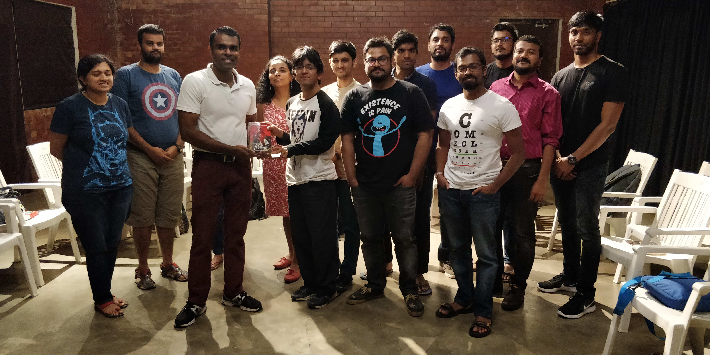
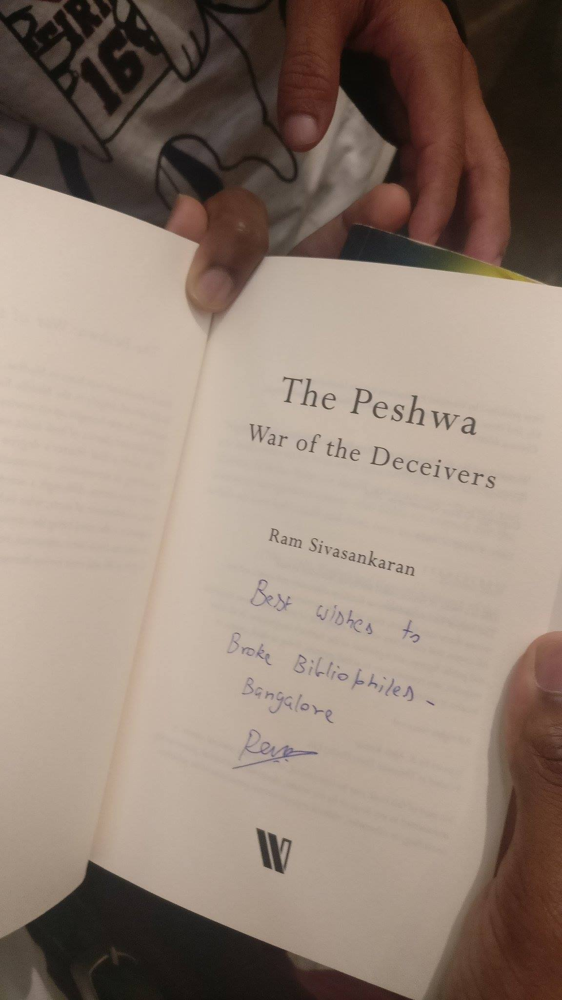

BBB had our 15th meetup on Sunday, the 26th of August. This was the first meetup that also included a published author Mr.Ram Sivasankaran in our midst and he spoke to us about how he came to be on the path to becoming an author and also about his motivation for the theme of his books, "The Lion and the Stallion" and "The Peshwa". Coffee and snacks as usual, amid sounds of the thunderstorm outside, made for an excellent meetup.

The following are the books that were discussed in the Aug 2018 meetup. 

- The Shadow Rising - WoT Book 4 - Robert Jordan
- Creativity Inc. - Ed Catmull
- The Crisis Within - G N Devy
- The Bard of Blood - Bilal Siddiqui
- Shot, Down - Vivek Rao
- The Granta Book of Reportage
- The Disappearance of Sally Sequeira - Bhaskar Chattopadhyay
- Democracy XI’s - Rajdeep Sardesai
- Becoming Indian - Pavan K Varma
- Sapiens - Yuval Noah Hariri
- Shoe Dog - Phil Knight 
- Kane and Abel - Jeffery Archer
- Norwegian Wood - Murakami 
- Couch - Benjamin Parzybok
- Quantum Thief - Hannu Rajaniemi
- Outliers - Malcolm Gladwell
- Focus - Daniel Goleman
- Djinn City - Saad Z Hossain
- Sabrina - Nick Drnazo
- The World According To Garp - John Irving
- The Subtle Art of Not Giving A F*ck - Mark Manson
- The Life and Times of The Thunderbolt Kid - Bill Bryson
- The Amazing Adventures of Kavalier and Clay - Michael Chabon
- Blood, Sweat and Pixes - Jason Schreier
- First Hand - Orijit Sen, Neha Dixit
- Chestle Beach - Ian McEwan
- Do Androids Dream of Electric Sheep? - PKD
- Color of Magic - Terry Pratchett 
- Tuesdays with Morrie - Mitch Albom
- Leila - Prayaag Akbar



<noscript>Please enable JavaScript to view the <a href="https://disqus.com/?ref_noscript">comments powered by Disqus.</a></noscript>
                            
