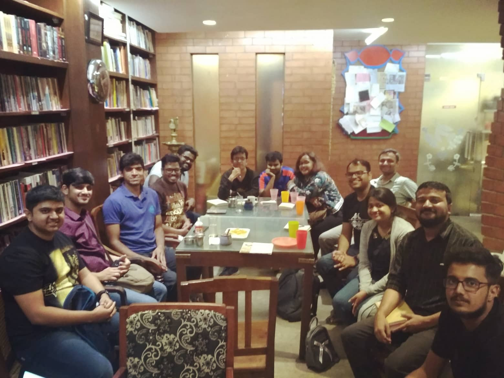

 13 people attended the Nov 25th 2018 BBB Meetup #16 in all and I hope the person who stood up first is still alright at the time of this writing (* chuckles to self *). Moving on. Apart from the fact that the discussion swept across a huuuge number of books as is evident from the list above, we had one other glimmer of awesomeness in that we had Solomon Manoj (who runs the Broke Bibliophiles Chennai chapter) in our midst this time and that was quite the icing on the cake. We also had a couple of newbies attend in addition to some of the oldheads. As always, I had a lot of fun and I hope those of you who attended did too! Thank you all :)

Until next time!

The following are the books that were discussed in the Nov 2018 meetup. -

- 3 body Problem (Remembrance of Earth’s Past #1) - https://www.goodreads.com/book/show/20518872-the-three-body-problem
- Dragon’s Egg (Cheela #1) - https://www.goodreads.com/book/show/263466.Dragon_s_Egg
- Starquake (Cheela #2) - https://www.goodreads.com/book/show/263487.Starquake
- Culture Series - https://www.goodreads.com/series/49118-culture
- Pachinko - https://www.goodreads.com/book/show/34051011-pachinko
- Deep Work - https://www.goodreads.com/book/show/25744928-deep-work
- Blink - https://www.goodreads.com/book/show/40102.Blink
- No one writes back - https://www.goodreads.com/book/show/17591572-no-one-writes-back
- The Vegetarian - https://www.goodreads.com/book/show/25489025-the-vegetarian
- The Childhood of Jesus - https://www.goodreads.com/book/show/15799416-the-childhood-of-jesus
- The Schooldays of Jesus - https://www.goodreads.com/book/show/29959887-the-schooldays-of-jesus
- The Google Story - https://www.goodreads.com/book/show/164323.The_Google_Story
- The Book Thief - https://www.goodreads.com/book/show/19063.The_Book_Thief
- The Mistress of Spices - https://www.goodreads.com/book/show/94669.The_Mistress_of_Spices
- Beyonders - https://www.goodreads.com/series/50390-beyonders
- The Final Empire (Mistborn #1) - https://www.goodreads.com/book/show/68428.The_Final_Empire
- The Dresden Files - https://www.goodreads.com/series/40346-the-dresden-files
- Happy! - https://www.goodreads.com/book/show/16173662-happy
- We3 - https://www.goodreads.com/book/show/22358.We3
- The Mermaid and Mrs Hancock - https://www.goodreads.com/book/show/37678008-the-mermaid-and-mrs-hancock
- Eleanor Oliphant is completely fine - https://www.goodreads.com/book/show/31434883-eleanor-oliphant-is-completely-fine
- A Man called Ove - https://www.goodreads.com/book/show/18774964-a-man-called-ove
- The Rosie Project - https://www.goodreads.com/book/show/16181775-the-rosie-project
- Trump’s First Year - https://www.goodreads.com/book/show/37507361-trump-s-first-year
- Stuff of Thought - https://www.goodreads.com/book/show/373969.The_Stuff_of_Thought
- My Hero Academia - https://www.goodreads.com/series/152982-my-hero-academia
- The 100-foot journey - https://www.goodreads.com/book/show/7347109-the-hundred-foot-journey
- Raakshas - Piyush Jha - https://www.goodreads.com/book/show/28240199-raakshas
- The Mahabharata Murders - https://www.goodreads.com/book/show/30058494-the-mahabharata-murders
- Gone Girl - https://www.goodreads.com/book/show/19288043-gone-girl
- All the lives we’ve never lived - https://www.goodreads.com/book/show/36391803-all-the-lives-we-never-lived
- Midnight’s Children - https://www.goodreads.com/book/show/14836.Midnight_s_Children
- Across the Universe (About the Beatles) - https://www.goodreads.com/book/show/38230262-across-the-universe
- Gita Press and the making of Hindu India - https://www.goodreads.com/book/show/26060875-gita-press-and-the-making-of-hindu-india
- Wheel of Time - https://www.goodreads.com/series/41526-the-wheel-of-time
- The Common Reader - https://www.goodreads.com/book/show/18840.The_Common_Reader
- The Taj Trilogy - https://www.goodreads.com/series/194638-taj-mahal-trilogy
- The Little Prince - https://www.goodreads.com/book/show/157993.The_Little_Prince
- The Guernsey Literary and Potato Peel Pie Society - https://www.goodreads.com/book/show/39832183-the-guernsey-literary-and-potato-peel-pie-society
- 84 ,Charing cross road - https://www.goodreads.com/book/show/368916.84_Charing_Cross_Road
- Ravan and Eddie - https://www.goodreads.com/book/show/109328.Ravan_Eddie
- Tlön, Uqbar, Orbis Tertius - https://www.goodreads.com/book/show/929587.Tl_n_Uqbar_Orbis_Tertius
- The Children of Men - https://www.goodreads.com/book/show/41913.The_Children_of_Men
- The Martian - https://www.goodreads.com/book/show/18007564-the-martian
- Guns, Germs and Steel - https://www.goodreads.com/book/show/1842.Guns_Germs_and_Steel
- Dogs of War - https://www.goodreads.com/book/show/35827220-dogs-of-war
- The invisibles - https://www.goodreads.com/book/show/13227839-the-invisibles
- Reaper Man (Discworld #11) - https://www.goodreads.com/book/show/34517.Reaper_Man
- Small Gods (Discworld #13) - https://www.goodreads.com/book/show/34484.Small_Gods
- The Amazing Maurice and his Educated Rodents (Discworld #28) - https://www.goodreads.com/book/show/34534.The_Amazing_Maurice_and_His_Educated_Rodents
- Extended Phenotype - https://www.goodreads.com/book/show/61538.The_Extended_Phenotype
- Food : A Cultural Culinary History - https://www.goodreads.com/book/show/18306118-food
- Flowers for Algernon - https://www.goodreads.com/book/show/36576608-flowers-for-algernon
- Maps of Meaning - https://www.goodreads.com/book/show/2218102.Maps_of_Meaning
- 12 Rules for Life - https://www.goodreads.com/book/show/30257963-12-rules-for-life
- Cult of Chaos - https://www.goodreads.com/book/show/24362983-cult-of-chaos
- The Matsya Curse - https://www.goodreads.com/book/show/35260120-the-matsya-curse
- The Missing Queen - https://www.goodreads.com/book/show/17301537-the-missing-queen
- Cyber Sexy - https://www.goodreads.com/book/show/39809069-cyber-sexy
- If it’s Monday, it must be Madurai - https://www.goodreads.com/book/show/19546759-if-it-s-monday-it-must-be-madurai
- How to travel light - https://www.goodreads.com/book/show/36474209-how-to-travel-light
- Ghachar Ghochar - https://www.goodreads.com/book/show/30267604-ghachar-ghochar
- The unbearable lightness of being - https://www.goodreads.com/book/show/9717.The_Unbearable_Lightness_of_Being
- Persepolis - https://www.goodreads.com/book/show/9516.Persepolis
- Illiberal India - https://www.goodreads.com/book/show/40280310-illiberal-india
- Miss Laila - Armed and Dangerous - https://www.goodreads.com/book/show/35620555-miss-laila-armed-and-dangerous
- The Illicit Happiness of Others - https://www.goodreads.com/book/show/13707645-the-illicit-happiness-of-other-people
- Serious Men - https://www.goodreads.com/book/show/7628608-serious-men
- Being a Mountain  - https://www.goodreads.com/book/show/22750072-becoming-a-mountain
- In Xanadu - https://www.goodreads.com/book/show/124431.In_Xanadu
- From the holy mountain - https://www.goodreads.com/book/show/104039.From_the_Holy_Mountain
- City of Djinns - https://www.goodreads.com/book/show/124430.City_of_Djinns
- Chai Chai - https://www.goodreads.com/book/show/7138803-chai-chai
- Last man in Tower - https://www.goodreads.com/book/show/10854908-last-man-in-tower
- Korma, Kheer and Kismat - https://www.goodreads.com/book/show/22914867-korma-kheer-kismet
- The Heat and Dust Project - https://www.goodreads.com/book/show/25521660-the-heat-and-dust-project
- The town that laughed -https://www.goodreads.com/book/show/41564553-the-town-that-laughed
- The Demon hunt of Chottanikkara - https://www.goodreads.com/book/show/35694433-the-demon-hunter-of-chottanikkara
-  Beyond Dharma - https://www.goodreads.com/book/show/40124170-beyond-dharma
- I am A troll - https://www.goodreads.com/book/show/33467606-i-am-a-troll
- Unreal Elections - https://www.goodreads.com/book/show/21935265-unreal-elections
- The Great Indian Novel - https://www.goodreads.com/book/show/30843.The_Great_Indian_Novel
- Why scams are here to stay - https://www.goodreads.com/book/show/35524453-why-scams-are-here-to-stay
- Between the  assassinations - https://www.goodreads.com/book/show/5743627-between-the-assassinations
- Letters to a young writer - https://www.goodreads.com/book/show/31371317-letters-to-a-young-writer
- A southern Music - https://www.goodreads.com/book/show/20320205-a-southern-music
- Shantaram - https://www.goodreads.com/book/show/33600.Shantaram
- Narcopolis - https://www.goodreads.com/book/show/12384322-narcopolis
- We that are young - https://www.goodreads.com/book/show/28800253-we-that-are-young
- Radical Candor - https://www.goodreads.com/book/show/29939161-radical-candor