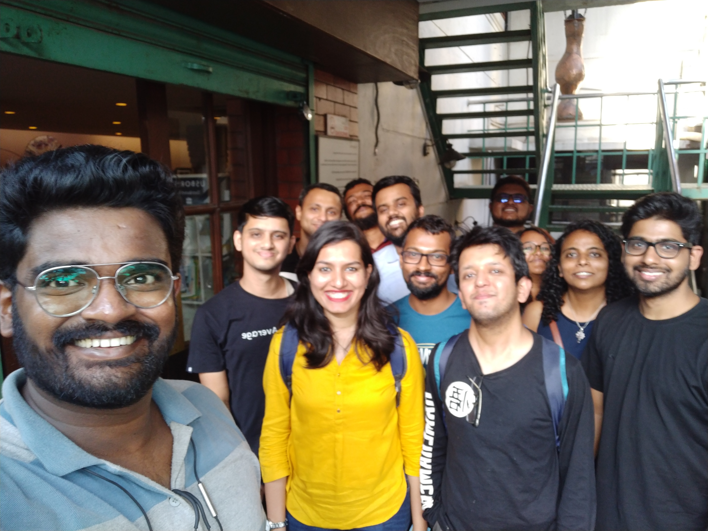

Today's meetup had 12 members attending and spanned 2 hours :)

The following were the books discussed -

- S ([https://www.goodreads.com/book/show/17860739-s](https://www.goodreads.com/book/show/17860739-s))
- The Age of Surveillance Capitalism ([https://www.goodreads.com/book/show/26195941-the-age-of-surveillance-capitalism](https://www.goodreads.com/book/show/26195941-the-age-of-surveillance-capitalism))
- The Lost Decade (2008-18) ([https://www.goodreads.com/book/show/45162304-the-lost-decade-2008-18](https://www.goodreads.com/book/show/45162304-the-lost-decade-2008-18))
- Multiple City ([https://www.goodreads.com/book/show/35068381-multiple-city](https://www.goodreads.com/book/show/35068381-multiple-city))
- Strange Worlds! Strange Times! ([https://www.goodreads.com/book/show/42964933-strange-worlds-strange-times-amazing-sci-fi-stories](https://www.goodreads.com/book/show/42964933-strange-worlds-strange-times-amazing-sci-fi-stories))
- The Sixth String of Vilayat Khan ([https://www.goodreads.com/book/show/42686678-the-sixth-string-of-vilayat-khan](https://www.goodreads.com/book/show/42686678-the-sixth-string-of-vilayat-khan))
- The Cricket War ([https://www.goodreads.com/book/show/34954111-the-cricket-war](https://www.goodreads.com/book/show/34954111-the-cricket-war))
- Remembrance of Earth's Past ([https://www.goodreads.com/series/189931-remembrance-of-earth-s-past](https://www.goodreads.com/series/189931-remembrance-of-earth-s-past))
- Ball Lightning ([https://www.goodreads.com/book/show/15822390](https://www.goodreads.com/book/show/15822390))
- The Wolf of Wall Street ([https://www.goodreads.com/book/show/522776.The_Wolf_of_Wall_Street](https://www.goodreads.com/book/show/522776.The_Wolf_of_Wall_Street))
- Flow ([https://www.goodreads.com/book/show/66354.Flow](https://www.goodreads.com/book/show/66354.Flow))
- Genghis Khan and the Making of the Modern World ([https://www.goodreads.com/book/show/40718726-genghis-khan-and-the-making-of-the-modern-world](https://www.goodreads.com/book/show/40718726-genghis-khan-and-the-making-of-the-modern-world))
- The Travels of Ibn Batuttah ([https://www.goodreads.com/book/show/517598.The_Travels_of_Ibn_Battutah](https://www.goodreads.com/book/show/517598.The_Travels_of_Ibn_Battutah))
- Binti : The Complete Trilogy ([https://www.goodreads.com/book/show/40382407-binti](https://www.goodreads.com/book/show/40382407-binti))
- Bloodchild ([https://www.goodreads.com/book/show/21265321-bloodchild](https://www.goodreads.com/book/show/21265321-bloodchild))
- Birthday Stories ([https://www.goodreads.com/book/show/45301.Birthday_Stories](https://www.goodreads.com/book/show/45301.Birthday_Stories))
- A Million Little Pieces ([https://www.goodreads.com/book/show/1241.A_Million_Little_Pieces](https://www.goodreads.com/book/show/1241.A_Million_Little_Pieces))
- Jeevichirikkunnavarkku Vendiyulla Oppees: Requiem for the Living ([https://www.goodreads.com/book/show/20663301-jeevichirikkunnavarkku-vendiyulla-oppees](https://www.goodreads.com/book/show/20663301-jeevichirikkunnavarkku-vendiyulla-oppees))
- Sad Girls ([https://www.goodreads.com/book/show/34023590-sad-girls](https://www.goodreads.com/book/show/34023590-sad-girls))
- Bombay Brides ([https://www.goodreads.com/book/show/40041682-bombay-brides](https://www.goodreads.com/book/show/40041682-bombay-brides))
- Ghoomophiro ([https://www.goodreads.com/book/show/43834912-ghoomophiro](https://www.goodreads.com/book/show/43834912-ghoomophiro))
- The Witches ([https://www.goodreads.com/book/show/6327.The_Witches](https://www.goodreads.com/book/show/6327.The_Witches))
- Big Magic ([https://www.goodreads.com/book/show/24453082-big-magic](https://www.goodreads.com/book/show/24453082-big-magic))
- Anita Gets Bail ([https://www.goodreads.com/book/show/39981886-anita-gets-bail](https://www.goodreads.com/book/show/39981886-anita-gets-bail))
- Early Indians ([https://www.goodreads.com/book/show/43305406-early-indians](https://www.goodreads.com/book/show/43305406-early-indians))
- Fox 8 ([https://www.goodreads.com/en/book/show/17620753](https://www.goodreads.com/en/book/show/17620753))
- The God of Small Things ([https://www.goodreads.com/book/show/9777.The_God_of_Small_Things](https://www.goodreads.com/book/show/9777.The_God_of_Small_Things))
- Big Little Lies ([https://www.goodreads.com/book/show/19486412-big-little-lies](https://www.goodreads.com/book/show/19486412-big-little-lies))
- Exit West ([https://www.goodreads.com/book/show/30688435-exit-west](https://www.goodreads.com/book/show/30688435-exit-west))
- The Adivasi will not dance ([https://www.goodreads.com/book/show/27240055-the-adivasi-will-not-dance](https://www.goodreads.com/book/show/27240055-the-adivasi-will-not-dance))
- The fifth Season ([https://www.goodreads.com/book/show/19161852-the-fifth-season](https://www.goodreads.com/book/show/19161852-the-fifth-season))
- American Gods ([https://www.goodreads.com/book/show/30165203-american-gods](https://www.goodreads.com/book/show/30165203-american-gods))

See you next time!



<noscript>Please enable JavaScript to view the <a href="https://disqus.com/?ref_noscript">comments powered by Disqus.</a></noscript>
                            
