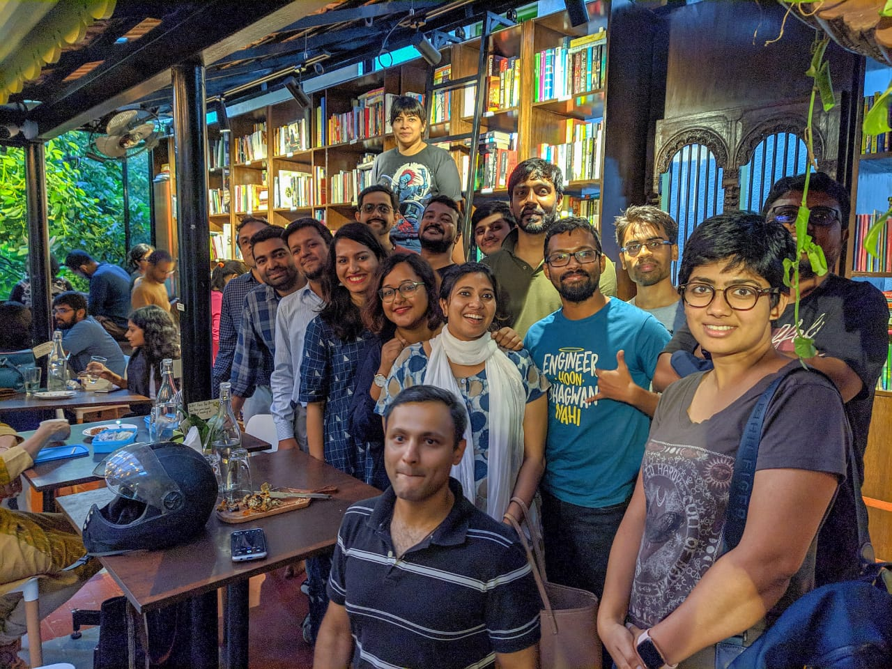

Today's meetup had 16 members attending and went on for a spirited 3 hours! This time, we switched locations from our regular favorite ([Atta Galatta](https://www.facebook.com/AttaGalattaBookstore/)) to a new bookcafe in the city - [Champaca](http://champaca.in) - and it.was.BEAUTIFUL! The members loved the place and the hosts Radhika, Pavithra and Rahul were awesome! :grin:

   

The following were the books discussed -

- Exit West ([https://www.goodreads.com/book/show/30688435-exit-west](https://www.goodreads.com/book/show/30688435-exit-west))
- The Reluctant Fundamentalist ([https://www.goodreads.com/book/show/40961543-the-reluctant-fundamentalist](https://www.goodreads.com/book/show/40961543-the-reluctant-fundamentalist))
- In the sea there are crocodiles ([https://www.goodreads.com/book/show/10291971-in-the-sea-there-are-crocodiles](https://www.goodreads.com/book/show/10291971-in-the-sea-there-are-crocodiles))
- And the mountains Echoed ([https://www.goodreads.com/book/show/16115612-and-the-mountains-echoed](https://www.goodreads.com/book/show/16115612-and-the-mountains-echoed))
- The Return ([https://www.goodreads.com/book/show/28007895-the-return](https://www.goodreads.com/book/show/28007895-the-return))
- In the country of men ([https://www.goodreads.com/book/show/63657.In_the_Country_of_Men](https://www.goodreads.com/book/show/63657.In_the_Country_of_Men))
- Good Talk ([https://www.goodreads.com/en/book/show/34953002](https://www.goodreads.com/en/book/show/34953002))
- The three-body problem ([https://www.goodreads.com/book/show/20518872-the-three-body-problem](https://www.goodreads.com/book/show/20518872-the-three-body-problem))
- Culture Series - [https://www.goodreads.com/series/49118-culture](https://www.goodreads.com/series/49118-culture)
- Dune ([https://www.goodreads.com/book/show/39776179-dune](https://www.goodreads.com/book/show/39776179-dune))
- The Quantum Thief ([https://www.goodreads.com/book/show/7562764-the-quantum-thief](https://www.goodreads.com/book/show/7562764-the-quantum-thief))
- Harappa Series ([https://www.goodreads.com/series/224809-harappa-series](https://www.goodreads.com/series/224809-harappa-series))
- Latitudes of Longing ([https://www.goodreads.com/en/book/show/40932440](https://www.goodreads.com/en/book/show/40932440))
- All the lives we've never lived ([https://www.goodreads.com/en/book/show/36391803](https://www.goodreads.com/en/book/show/36391803))
- Munnu ([https://www.goodreads.com/en/book/show/25394441](https://www.goodreads.com/en/book/show/25394441))
- Hangwoman ([https://www.goodreads.com/book/show/17154644-aarachar](https://www.goodreads.com/book/show/17154644-aarachar))
- The Vegetarian ([https://www.goodreads.com/book/show/25489025-the-vegetarian](https://www.goodreads.com/book/show/25489025-the-vegetarian))
- How I became a tree ([https://www.goodreads.com/book/show/34532567-how-i-became-a-tree](https://www.goodreads.com/book/show/34532567-how-i-became-a-tree))
- Insects Are Just Like You and Me Except Some of Them Have Wings ([https://www.goodreads.com/book/show/4026537-insects-are-just-like-you-and-me-except-some-of-them-have-wings](https://www.goodreads.com/book/show/4026537-insects-are-just-like-you-and-me-except-some-of-them-have-wings))
- Remnants of A Separation ([https://www.goodreads.com/en/book/show/36001646](https://www.goodreads.com/en/book/show/36001646))
- Big Magic ([https://www.goodreads.com/book/show/24453082-big-magic](https://www.goodreads.com/book/show/24453082-big-magic))
- The Day the Crayons Quit ([https://www.goodreads.com/book/show/16101018-the-day-the-crayons-quit](https://www.goodreads.com/book/show/16101018-the-day-the-crayons-quit))
- Fox 8 (George Sanders) ([https://www.goodreads.com/book/show/17620753-fox-8](https://www.goodreads.com/book/show/17620753-fox-8))
- The legend of rock, Paper and Scissors - [https://www.goodreads.com/book/show/31215005-the-legend-of-rock-paper-scissors](https://www.goodreads.com/book/show/31215005-the-legend-of-rock-paper-scissors)
- At the Same Time: Essays and Speeches ([https://www.goodreads.com/book/show/149029.At_the_Same_Time](https://www.goodreads.com/book/show/149029.At_the_Same_Time))
- Duck death and the tulips ([https://www.goodreads.com/book/show/12666682-duck-death-and-the-tulip](https://www.goodreads.com/book/show/12666682-duck-death-and-the-tulip))
- Newcomer ([https://www.goodreads.com/book/show/43616256-newcomer](https://www.goodreads.com/book/show/43616256-newcomer))
- The devotion of suspect X ([https://www.goodreads.com/book/show/8686068-the-devotion-of-suspect-x](https://www.goodreads.com/book/show/8686068-the-devotion-of-suspect-x))
- Becoming ([https://www.goodreads.com/book/show/38746485-becoming](https://www.goodreads.com/book/show/38746485-becoming))
- Uncommon type ([https://www.goodreads.com/book/show/34389773-uncommon-type](https://www.goodreads.com/book/show/34389773-uncommon-type))
- Beast ([https://www.goodreads.com/en/book/show/44587297](https://www.goodreads.com/en/book/show/44587297))
- Superintelligence ([https://www.goodreads.com/book/show/20527133-superintelligence](https://www.goodreads.com/book/show/20527133-superintelligence))
- Homo Deus ([https://www.goodreads.com/book/show/31138556-homo-deus](https://www.goodreads.com/book/show/31138556-homo-deus))
- The forty rules of love ([https://www.goodreads.com/book/show/6642715-the-forty-rules-of-love](https://www.goodreads.com/book/show/6642715-the-forty-rules-of-love))
- Leila ([https://www.goodreads.com/book/show/34932175-leila](https://www.goodreads.com/book/show/34932175-leila))
- Bombay Brides ([https://www.goodreads.com/en/book/show/40041682](https://www.goodreads.com/en/book/show/40041682))
- An American Marriage  ([https://www.goodreads.com/book/show/33590210-an-american-marriage](https://www.goodreads.com/book/show/33590210-an-american-marriage))
- Perfume - Story of a murderer ([https://www.goodreads.com/book/show/343.Perfume](https://www.goodreads.com/book/show/343.Perfume))
- Arcanum Unbounded ([https://www.goodreads.com/book/show/28595941-arcanum-unbounded](https://www.goodreads.com/book/show/28595941-arcanum-unbounded))
- The Emperor's Soul ([https://www.goodreads.com/book/show/13578175-the-emperor-s-soul](https://www.goodreads.com/book/show/13578175-the-emperor-s-soul))
- The Obelisk Gate ([https://www.goodreads.com/book/show/26228034-the-obelisk-gate](https://www.goodreads.com/book/show/26228034-the-obelisk-gate))
- At the existential cafe ([https://www.goodreads.com/book/show/25658482-at-the-existentialist-caf](https://www.goodreads.com/book/show/25658482-at-the-existentialist-caf))
- Man's Search for Meaning ([https://www.goodreads.com/book/show/4069.Man_s_Search_for_Meaning](https://www.goodreads.com/book/show/4069.Man_s_Search_for_Meaning))
- Siddhartha ([https://www.goodreads.com/book/show/52036.Siddhartha](https://www.goodreads.com/book/show/52036.Siddhartha))
- Mr. God, This is Anna ([https://www.goodreads.com/book/show/50807.Mister_God_This_is_Anna](https://www.goodreads.com/book/show/50807.Mister_God_This_is_Anna))
- The Old Man and the Sea ([https://www.goodreads.com/book/show/2165.The_Old_Man_and_the_Sea](https://www.goodreads.com/book/show/2165.The_Old_Man_and_the_Sea))
- Trade Winds ([https://www.goodreads.com/book/show/10218.Trade_Wind](https://www.goodreads.com/book/show/10218.Trade_Wind))
- The Bear and the Nightingale ([https://www.goodreads.com/book/show/25489134-the-bear-and-the-nightingale](https://www.goodreads.com/book/show/25489134-the-bear-and-the-nightingale))
- All the light we cannot see ([https://www.goodreads.com/book/show/18143977-all-the-light-we-cannot-see](https://www.goodreads.com/book/show/18143977-all-the-light-we-cannot-see))
- Ben hur ([https://www.goodreads.com/book/show/387749.Ben_Hur](https://www.goodreads.com/book/show/387749.Ben_Hur))
- Stephen Alter (The Cloud Farers)
- 1947 partition boxset
- Rebel Sultans ([https://www.goodreads.com/book/show/40506778-rebel-sultans](https://www.goodreads.com/book/show/40506778-rebel-sultans))
- Ivory Throne ([https://www.goodreads.com/book/show/28264135-ivory-throne](https://www.goodreads.com/book/show/28264135-ivory-throne))
- Aurangzeb ([https://www.goodreads.com/book/show/34265228-aurangzeb](https://www.goodreads.com/book/show/34265228-aurangzeb))
- Daytripper ([https://www.goodreads.com/book/show/8477057-daytripper](https://www.goodreads.com/book/show/8477057-daytripper))
- Tatami Galaxy ([https://www.goodreads.com/book/show/26597708-the-tatami-galaxy](https://www.goodreads.com/book/show/26597708-the-tatami-galaxy))
- Pachinko ([https://www.goodreads.com/book/show/34051011-pachinko](https://www.goodreads.com/book/show/34051011-pachinko))
- Circe ([https://www.goodreads.com/book/show/35959740-circe](https://www.goodreads.com/book/show/35959740-circe))
- Good Omens ([https://www.goodreads.com/book/show/12067.Good_Omens](https://www.goodreads.com/book/show/12067.Good_Omens))
- Cracking the Coding Interview ([https://www.goodreads.com/book/show/12544648-cracking-the-coding-interview](https://www.goodreads.com/book/show/12544648-cracking-the-coding-interview))
- The Strange Library ([https://www.goodreads.com/book/show/23128304-the-strange-library](https://www.goodreads.com/book/show/23128304-the-strange-library))
- Chaos ([https://www.goodreads.com/en/book/show/64582](https://www.goodreads.com/en/book/show/64582))
- Broca's Brain ([https://www.goodreads.com/book/show/485812.Broca_s_Brain](https://www.goodreads.com/book/show/485812.Broca_s_Brain))
- Ken Liu
- Invisible Planets ([https://www.goodreads.com/book/show/28220730-invisible-planets](https://www.goodreads.com/book/show/28220730-invisible-planets))
- Confessions of a banker ([https://www.goodreads.com/book/show/30822002-confessions-of-a-banker](https://www.goodreads.com/book/show/30822002-confessions-of-a-banker))
- The Global Novel ([https://www.goodreads.com/en/book/show/31213627](https://www.goodreads.com/en/book/show/31213627))

And thanks to Alfa for providing us this treasure of recommendations about and related to the 1947 partition - 

### Fiction - 

- In freedom's shade ([https://www.goodreads.com/en/book/show/11467809](https://www.goodreads.com/en/book/show/11467809))
- Ice Candyman/ Cracking India ([https://www.goodreads.com/book/show/40238.Cracking_India](https://www.goodreads.com/book/show/40238.Cracking_India))
- Toba Tek Singh ([https://www.goodreads.com/book/show/11961425-toba-tek-singh](https://www.goodreads.com/book/show/11961425-toba-tek-singh))
- Train to Pakistan ([https://www.goodreads.com/book/show/785454.Train_to_Pakistan](https://www.goodreads.com/book/show/785454.Train_to_Pakistan))
- This is not that dawn ([https://www.goodreads.com/book/show/9850018-this-is-not-that-dawn](https://www.goodreads.com/book/show/9850018-this-is-not-that-dawn))

### Non-Fiction - 

- The great partition ([https://www.goodreads.com/book/show/721931.The_Great_Partition](https://www.goodreads.com/book/show/721931.The_Great_Partition))
- Making sense of Pakistan ([https://www.goodreads.com/book/show/5912577-making-sense-of-pakistan](https://www.goodreads.com/book/show/5912577-making-sense-of-pakistan))
- Mr. and Mrs. Jinnah: The Marriage that Shook India ([https://www.goodreads.com/en/book/show/34297262](https://www.goodreads.com/en/book/show/34297262))
- Remnants of separation: A history of the partition through material memory ([https://www.goodreads.com/en/book/show/36001646](https://www.goodreads.com/en/book/show/36001646))
- The last Mughal ([https://www.goodreads.com/book/show/124429.The_Last_Mughal](https://www.goodreads.com/book/show/124429.The_Last_Mughal))

## Additional authors mentioned - 

- China Meville
- Ted Chiang

If you have any suggestions to be added on this list, please feel free to leave it in the comments below!

See you next time! :blush:



<noscript>Please enable JavaScript to view the <a href="https://disqus.com/?ref_noscript">comments powered by Disqus.</a></noscript>
                            
