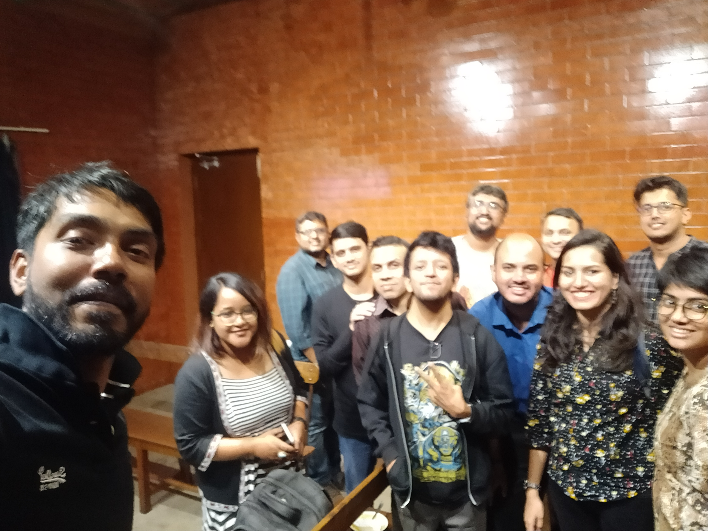

I'll write the preamble to this meetup later. Too sleepy right now. Had a lot of fun though :D
Thank you all for coming :blush:

   

Yes, Pratik Das is an amazing person but evidently the worst photographer.

The following were the books (and authors - indicated by 'A' ) discussed -

- Born a Crime - https://www.goodreads.com/book/show/29780253-born-a-crime
- David Eddings (A) - https://www.goodreads.com/author/show/8732.David_Eddings
- Terry Brooks (A)
- The Kingkiller Chronicles - https://www.goodreads.com/series/45262-the-kingkiller-chronicle
- Dragonlance Chronicles - https://www.goodreads.com/book/show/68380.Dragonlance_Chronicles
- Bestseller - https://www.goodreads.com/book/show/43081737-bestseller
- American Gods - https://www.goodreads.com/book/show/30165203-american-gods
- Salvation of a Saint - https://www.goodreads.com/book/show/13506866-salvation-of-a-saint
- Cloud Atlas - https://www.goodreads.com/book/show/49628.Cloud_Atlas
- Big Magic - https://www.goodreads.com/book/show/24453082-big-magic
- Creative Confidence - https://www.goodreads.com/book/show/17288649-creative-confidence
- Birthday Girl - https://www.goodreads.com/fa/book/show/40554247-birthday-girl
- Sin City series - https://www.goodreads.com/series/41848-sin-city
- The Legacy of Nothing - https://www.goodreads.com/book/show/43704648-the-legacy-of-nothing
- What We Talk About When We Talk About Love - https://www.goodreads.com/book/show/11438.What_We_Talk_About_When_We_Talk_About_Love
- Birthday Stories - https://www.goodreads.com/book/show/45301.Birthday_Stories
- Fifty Things That Made the Modern Economy - https://www.goodreads.com/book/show/35192961-fifty-things-that-made-the-modern-economy
- Eat, Pray, Love - https://www.goodreads.com/book/show/19501.Eat_Pray_Love
- Pachinko - https://www.goodreads.com/book/show/34051011-pachinko
- The Metamorphosis - https://www.goodreads.com/book/show/485894.The_Metamorphosis
- Daisy Jones & The Six - https://www.goodreads.com/book/show/40597810-daisy-jones-the-six
- India after Gandhi - https://www.goodreads.com/book/show/356824.India_After_Gandhi
- The unbearable lightness of being - https://www.goodreads.com/book/show/9717.The_Unbearable_Lightness_of_Being
- The Sense of an Ending - https://www.goodreads.com/book/show/10746542-the-sense-of-an-ending
- A Suitable Boy - https://www.goodreads.com/book/show/50365.A_Suitable_Boy
- Nobody's Victim - https://www.goodreads.com/book/show/43183922-nobody-s-victim
- Latitudes of Longing - https://www.goodreads.com/en/book/show/40932440
- Guns, Germs and Steel - https://www.goodreads.com/book/show/1842.Guns_Germs_and_Steel
- Roar - https://www.goodreads.com/book/show/36612327-roar
- The Cloudfarers - https://www.goodreads.com/book/show/39704638-the-cloudfarers
- Love in the time of Cholera - https://www.goodreads.com/book/show/9712.Love_in_the_Time_of_Cholera
- The Undoing Project : A friendship that changed our minds - https://www.goodreads.com/book/show/35631386-the-undoing-project
- Lone wolf and Cub - https://www.goodreads.com/series/49917-lone-wolf-and-cub
- Buddha series (Graphic Novel) - https://www.goodreads.com/series/67448-buddha
- Time Travel : A History - https://www.goodreads.com/book/show/28587584-time-travel
- Hominids (?)
- The Philosopher and the Wolf - https://www.goodreads.com/book/show/5590168-the-philosopher-and-the-wolf
- Introduction to Philosophy(?)
- What the dog Saw - https://www.goodreads.com/book/show/6516450-what-the-dog-saw-and-other-adventures
- Late Bloomers(?)
- Harry Potter and Methods of Rationality - https://www.goodreads.com/book/show/10016013-harry-potter-and-the-methods-of-rationality
- Sherlock Holmes
- Texas - https://www.goodreads.com/book/show/12659.Texas
- I'd rather be reading - https://www.goodreads.com/book/show/38502471-i-d-rather-be-reading
- Of Swans and Songs - https://www.goodreads.com/book/show/47551240-of-swans-and-songs
- Margaret Weis (A) - https://www.fantasticfiction.com/w/margaret-weis/

### Other related Mentions 
- GraphicAudio books - https://www.graphicaudiointernational.net/

See you all next time! :blush:



<noscript>Please enable JavaScript to view the <a href="https://disqus.com/?ref_noscript">comments powered by Disqus.</a></noscript>
                            
