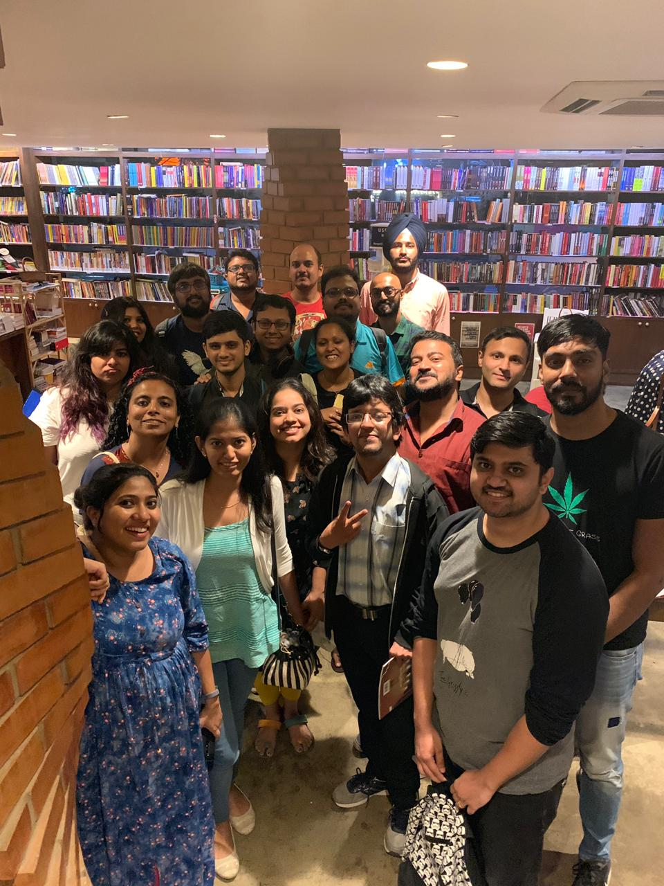

We had 20 people at the meetup this Sunday and we had more than the usual number of newbies! The discussions got very spirited very fast and I personally enjoyed it all, a lot. I hope you did too :)

   

The following were the books discussed -

- Pachinko - https://www.goodreads.com/book/show/34051011-pachinko
- Fooled by Randomness - https://www.goodreads.com/book/show/38315.Fooled_by_Randomness
- Factfulness - https://www.goodreads.com/book/show/34890015-factfulness
- Cities and Canopies - https://www.goodreads.com/book/show/45839260-cities-and-canopies
- 10 Minutes 38 Seconds in this Strange World - https://www.goodreads.com/book/show/43706466-10-minutes-38-seconds-in-this-strange-world
- Of Swans and Songs - https://www.goodreads.com/book/show/47551240-of-swans-and-songs
- The Waves - https://www.goodreads.com/book/show/46114.The_Waves
- Late Bloomers - https://www.goodreads.com/book/show/40597806-late-bloomers
- The Silent Patient - https://www.goodreads.com/book/show/40097951-the-silent-patient
- A Man called Ove - https://www.goodreads.com/book/show/18774964-a-man-called-ove
- In Custody - https://www.goodreads.com/book/show/36004.In_Custody?
- The difficulty of being good - https://www.goodreads.com/book/show/6971900-the-difficulty-of-being-good
- The Palace of Illusions - https://www.goodreads.com/book/show/1774836.The_Palace_of_Illusions
- The Forest of Enchantments - https://www.goodreads.com/en/book/show/43293099
- The Call of Cthulhu - https://www.goodreads.com/book/show/15730101-the-call-of-cthulhu
- The Boys - https://www.goodreads.com/series/59108-the-boys-collected-editions
- Book of Blood (?)
- The Overstory - https://www.goodreads.com/book/show/40180098-the-overstory
- Sourdough - https://www.goodreads.com/book/show/33916024-sourdough
- Love in the time of Cholera - https://www.goodreads.com/book/show/9712.Love_in_the_Time_of_Cholera
- Murmur of Bees - https://www.goodreads.com/book/show/41574696-the-murmur-of-bees
- I'd Rather Be Reading - https://www.goodreads.com/book/show/38502471-i-d-rather-be-reading
- Eat, Pray, Love - https://www.goodreads.com/book/show/19501.Eat_Pray_Love
- Big Magic - https://www.goodreads.com/book/show/24453082-big-magic
- Baaz - https://www.goodreads.com/book/show/34724758-baaz
- A Gallery of Rascals - https://www.goodreads.com/book/show/47581217-a-gallery-of-rascals
- The Curious Incident of the Dog in the Night-Time - https://www.goodreads.com/book/show/1618.The_Curious_Incident_of_the_Dog_in_the_Night_Time
- Prison Diaries Vol 1 - https://www.goodreads.com/series/60789-a-prison-diary
- An African Story - https://www.goodreads.com/book/show/19771198-an-african-story?
- The Atlas of Reds and Blues - https://www.goodreads.com/book/show/40723304-the-atlas-of-reds-and-blues
- Born a Crime - https://www.goodreads.com/book/show/29780253-bozrn-a-crime
- Ghachar Ghochar - https://www.goodreads.com/book/show/30267604-ghachar-ghochar
- The Three Body Problem- https://www.goodreads.com/book/show/20518872-the-three-body-problem
- Permanent Record - https://www.goodreads.com/book/show/46223297-permanent-record
- Last Train to Istanbul - https://www.goodreads.com/book/show/17779550-last-train-to-istanbul
- The Doctor and the Saint: Caste, Race, and Annihilation of Caste, the Debate Between B.R. Ambedkar and M.K. Gandhi - https://www.goodreads.com/book/show/31945021-the-doctor-and-the-saint
- The Argumentative Indian - https://www.goodreads.com/book/show/10310.The_Argumentative_Indian
- Gandhi before India - https://www.goodreads.com/book/show/18310148-gandhi-before-india
- The Sixth Extinction
- Coraline - https://www.goodreads.com/book/show/17061.Coraline
- Mythos - https://www.goodreads.com/book/show/35074096-mythos
- The Lies of Locke Lamora - https://www.goodreads.com/book/show/29588376-the-lies-of-locke-lamora
- Notes on a Nervous Planet - https://www.goodreads.com/book/show/40404801-notes-on-a-nervous-planet
- The Nine-Chambered Heart - https://www.goodreads.com/book/show/36396222-the-nine-chambered-heart
- Discworld
- Fried Green Tomatoes at the Whistle Stop Cafe - https://www.goodreads.com/book/show/9375.Fried_Green_Tomatoes_at_the_Whistle_Stop_Cafe
- The Stationery Shop - https://www.goodreads.com/book/show/42201995-the-stationery-shop
- Tales set in ancient Egypt
- The Rat Series -https://www.goodreads.com/series/56960-the-rat
- American Gods - https://www.goodreads.com/book/show/30165203-american-gods
- Neverwhere - https://www.goodreads.com/book/show/14497.Neverwhere
- The Graveyard Book - https://www.goodreads.com/book/show/2213661.The_Graveyard_Book
- The Ocean at the End of the Lane
 - https://www.goodreads.com/book/show/15783514-the-ocean-at-the-end-of-the-lane
- Good Omens - https://www.goodreads.com/book/show/12067.Good_Omens
- The Yellow-Lighted bookshop - https://www.goodreads.com/book/show/165518.The_Yellow_Lighted_Bookshop
- East of Eden - https://www.goodreads.com/book/show/4406.East_of_Eden
- The Grapes of Wrath - https://www.goodreads.com/book/show/18114322-the-grapes-of-wrath
- The Dark Tower - https://www.goodreads.com/series/40750-the-dark-tower
- While mortals sleep - https://www.goodreads.com/book/show/8352512-while-mortals-sleep
- The Wandering Earth - https://www.goodreads.com/book/show/13554058-the-wandering-earth
- Skin in the Game - https://www.goodreads.com/book/show/36064445-skin-in-the-game
- The Black Swan - https://www.goodreads.com/book/show/242472.The_Black_Swan
- The Silk Roads - https://www.goodreads.com/book/show/25812847-the-silk-roads
- Man's Search for Meaning - https://www.goodreads.com/book/show/4069.Man_s_Search_for_Meaning
- Journey under the Midnight Sun - https://www.goodreads.com/book/show/19256975-journey-under-the-midnight-sun

### Other related Mentions 
- What Should I Read Next? https://modernmrsdarcy.com/what-should-i-read-next/
- One Great Book - https://modernmrsdarcy.com/onegreatbook/ 

Understandably, some of these books have been discussed in the past as well.

If you're reading any of these and want to tell us about your thoughts, leave them in the comments below :)

Until next time! :blush:



<noscript>Please enable JavaScript to view the <a href="https://disqus.com/?ref_noscript">comments powered by Disqus.</a></noscript>
                            
