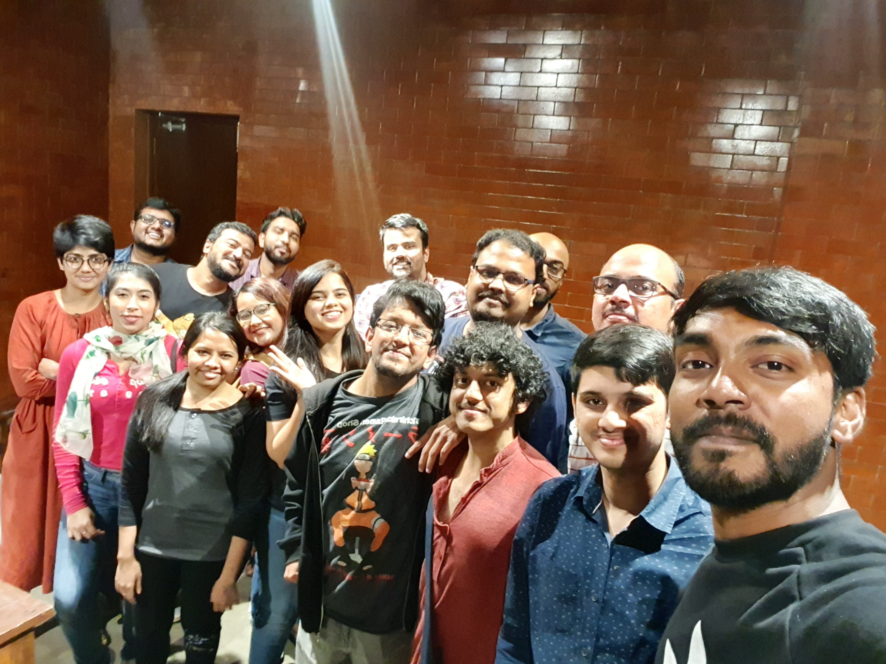

There were 17 people at our 24th meetup on the 24th of November and this time, we were joined by the awesome [Gautam Shenoy](https://twitter.com/theBekku), but in true celebrity fashion, he escaped the glare of the paparazzi and therefore does not feature in the picture below :( Jokes apart though, I learnt about a lot of new books in this meetup and I hope you all did too :blush:

   

This time Mr.Das was an excellent photographer in addition to being an awesome person. (Redemption)

The following were the books discussed (and yes, this is a Lot of books. Guess this is what happens when you skip a month's meetup :D) -

### Books by Foreign authors: 

- Creative Confidence - https://www.goodreads.com/book/show/17288649-creative-confidence
- How to be Human - https://www.goodreads.com/book/show/36200532-how-to-be-human
- A Christmas Carol - https://www.goodreads.com/book/show/5326.A_Christmas_Carol
- Milkman - https://www.goodreads.com/book/show/36047860-milkman
- Great American Short Stories - https://www.goodreads.com/book/show/47979586-great-american-short-stories
- Creativity Inc - https://www.goodreads.com/book/show/18077903-creativity-inc
- Creative Struggle : Zen Pencils - https://www.goodreads.com/en/book/show/35924700
- Ducks, Newburyport - https://www.goodreads.com/en/book/show/43412920
- The Testaments - https://www.goodreads.com/book/show/42975172-the-testaments
- Girl, Woman, Other - https://www.goodreads.com/en/book/show/41081373
- Gunboat Jack - https://www.goodreads.com/book/show/48929657-gunboat-jack
- Pan's Labyrinth - https://www.goodreads.com/book/show/42117981-pan-s-labyrinth
- Flatland - https://www.goodreads.com/book/show/433567.Flatland
- Gödel, Escher, Bach: An Eternal Golden Braid - https://www.goodreads.com/book/show/24113.G_del_Escher_Bach
- The Mind's I - https://www.goodreads.com/book/show/2081.The_Mind_s_I
- A Gentleman in Moscow - https://www.goodreads.com/book/show/34066798-a-gentleman-in-moscow
- Underland - https://www.goodreads.com/book/show/41817481-underland
- Shoe Dog - https://www.goodreads.com/book/show/27220736-shoe-dog
- Open - https://www.goodreads.com/book/show/6480781-open
- The Emperor's New Mind - https://www.goodreads.com/book/show/179744.The_Emperor_s_New_Mind
- Phantoms in the Brain - https://www.goodreads.com/book/show/31555.Phantoms_in_the_Brain
- God Created The Integers - https://www.goodreads.com/book/show/2096.God_Created_the_Integers
- Programmed Inequality -  https://www.goodreads.com/book/show/32078427-programmed-inequality
- Freedom at Midnight - https://www.goodreads.com/book/show/204123.Freedom_at_Midnight
- The Philosopher and the Wolf - https://www.goodreads.com/book/show/5590168-the-philosopher-and-the-wolf
- The Third Chimpanzee - https://www.goodreads.com/book/show/49234.The_Third_Chimpanzee
- Mushi Shi - https://www.goodreads.com/book/show/905756.Mushishi_Vol_1
- The last question - https://www.goodreads.com/book/show/4808763-the-last-question
- The 6th Extinction - https://www.goodreads.com/book/show/17910054-the-sixth-extinction
- Foundation - https://www.goodreads.com/topic/list_book/46654.The_Foundation_Trilogy
- Flowers for Algernon - https://www.goodreads.com/book/show/36576608-flowers-for-algernon
- The End of your Life Book Club - https://www.goodreads.com/book/show/13414676-the-end-of-your-life-book-club
- You Beneath Your Skin - https://www.goodreads.com/en/book/show/47634028
- Accidental Magic - https://www.goodreads.com/book/show/15805132-accidental-magic
- Thuppari...(?)
- The Light Fantastic - https://www.goodreads.com/book/show/34506.The_Light_Fantastic
- Equal Rites - https://www.goodreads.com/book/show/34507.Equal_Rites
- American Gods - https://www.goodreads.com/book/show/30165203-american-gods
- The Upside of Irrationality - https://www.goodreads.com/book/show/7815744-the-upside-of-irrationality
- 50 Things that Shaped Irrationality - https://www.goodreads.com/book/show/33358206-fifty-inventions-that-shaped-the-modern-economy
- Steve Jobs - https://www.goodreads.com/book/show/11084145-steve-jobs
- Snow - https://www.goodreads.com/book/show/11691.Snow
- Sons of Fortune - https://www.goodreads.com/book/show/78985.Sons_of_Fortune
- Fermat's Enigma - https://www.goodreads.com/book/show/38412.Fermat_s_Enigma
- 84, Charing Cross - https://www.goodreads.com/book/show/368916.84_Charing_Cross_Road
- The Collected Works of AJ Fikrey - https://www.goodreads.com/book/show/18293427-the-storied-life-of-a-j-fikry
- The Astonishing Color of After - https://www.goodreads.com/book/show/35604686-the-astonishing-color-of-after
- The purgatory of Half Forgotten Riddles - https://www.goodreads.com/book/show/48418060-the-purgatory-of-half-forgotten-riddles
- Ball Lightning - https://www.goodreads.com/book/show/32076670-ball-lightning
- Dr. Sleep - https://www.goodreads.com/book/show/16130549-doctor-sleep?
- Perennial Seller - https://www.goodreads.com/book/show/32968546-perennial-seller
- The Man who Played with Fire - https://www.goodreads.com/cs/book/show/43887587-the-man-who-played-with-fire
- Hickey's Bengal Gazette - https://www.goodreads.com/book/show/40186305-hicky-s-bengal-gazette
- Parliamental - https://www.goodreads.com/book/show/46360973-parliamental
- Homo Deus - https://www.goodreads.com/book/show/31138556-homo-deus
- Man's Search for Meaning - https://www.goodreads.com/book/show/4069.Man_s_Search_for_Meaning
- By the River Piedra I Sat Down and Wept - https://www.goodreads.com/book/show/1428.By_the_River_Piedra_I_Sat_Down_and_Wept
- Siddhartha - https://www.goodreads.com/book/show/52036.Siddhartha
- On the shortness of Life - https://www.goodreads.com/book/show/97412.On_the_Shortness_of_Life
- Angels and Demons - https://www.goodreads.com/book/show/643301.Angels_and_Demons_The_Da_Vinci_Code
- Scythe - https://www.goodreads.com/book/show/28954189-scythe
- My Lovely Wife - https://www.goodreads.com/book/show/39796904-my-lovely-wife
- Carry On - https://www.goodreads.com/book/show/32768522-carry-on
- The Honeymooner - https://www.goodreads.com/en/book/show/40606975
- The Unhoneymooners - https://www.goodreads.com/book/show/42201431-the-unhoneymooners
- The turn of the Key - https://www.goodreads.com/book/show/42080142-the-turn-of-the-key
- Salt to the Sea - https://www.goodreads.com/book/show/25614492-salt-to-the-sea
- Gods without Men - https://www.goodreads.com/book/show/11076138-gods-without-men
- Weapons of Math Destruction - https://www.goodreads.com/book/show/28186015-weapons-of-math-destruction
- Skin in the Game - https://www.goodreads.com/book/show/36064445-skin-in-the-game
- Karl Marx's Greatness and Illusion - https://www.goodreads.com/book/show/29613503-karl-marx

### Books by Indian authors: 

- Bhaunri - https://www.goodreads.com/en/book/show/46033194
- Daura - https://www.goodreads.com/book/show/46016752-daura
- Patang - https://www.goodreads.com/en/book/show/29771980
- Speaking of Shiva - https://www.goodreads.com/book/show/389661.Speaking_of_Siva
- Ladies Coupe - https://www.goodreads.com/book/show/109728.Ladies_Coup_
- Roads to Mussoorie - https://www.goodreads.com/book/show/2006883.Roads_To_Mussoorie
- The Nine Chambered Heart - https://www.goodreads.com/book/show/36396222-the-nine-chambered-heart
- Boats on Land - https://www.goodreads.com/book/show/16069752-boats-on-land
- Gita Press & The making of Hindu India - https://www.goodreads.com/book/show/26060875-gita-press-and-the-making-of-hindu-india
- The Palace of Illusions - https://www.goodreads.com/book/show/1774836.The_Palace_of_Illusions
- The ugliness of the Indian Male and other propositions - https://www.goodreads.com/book/show/3750744-the-ugliness-of-the-indian-male-and-other-propositions

### Graphic Novels & (Indie)Comics :

- Sabrina - https://www.goodreads.com/book/show/37533587-sabrina
- Bangalore - https://www.goodreads.com/book/show/34448178-bangalore
- Penumbra (Janardan Maity #1) - https://www.goodreads.com/en/book/show/31348457
- Here Falls The Shadow (Janardan Maity #2) - https://www.goodreads.com/book/show/34953165-here-falls-the-shadow
- The disappearance of Sally Sequeira (Janardan Maity #3) - https://www.goodreads.com/book/show/40183115-the-disappearance-of-sally-sequeira
- Lone Wolf and Cub - https://www.goodreads.com/book/show/191212.Lone_Wolf_and_Cub_Vol_1
- Buddha - https://www.goodreads.com/series/67448-buddha
- Opus - https://www.goodreads.com/en/book/show/22551869
- My Inktober Story
- Paper dosa
- Munnu - https://www.goodreads.com/en/book/show/25394441

### Other related Mentions 
- Flatland, The Film - https://www.youtube.com/watch?v=Mfglluny8Z0
- Godel, Escher, Bach : A lecture Part 1 - https://www.youtube.com/watch?v=lWZ2Bz0tS-s
- Godel, Escher, Bach : A lecture Part 2 - https://www.youtube.com/watch?v=HqmUuHnvJ98

### Member's Picks

As of this edition, we're starting this section where we'll pick 2 of BBB's more ...voracious.. readers and have them mention separately some books that they particularly liked for this month. These books were not discussed but they will be in the next meetup :)

[Rida's](https://www.goodreads.com/user/show/75843339-rida-quraishi) picks:
- Wish I Could Tell You - https://www.goodreads.com/book/show/47872026-wish-i-could-tell-you
- Dating You Hating You - https://www.goodreads.com/book/show/32620304-dating-you-hating-you
- Her Royal Highness - https://www.goodreads.com/en/book/show/41734205
- In an Absent Dream - https://www.goodreads.com/book/show/38244358-in-an-absent-dream
- On Dublin Street - https://www.goodreads.com/book/show/15760001-on-dublin-street

[Varun's](https://www.goodreads.com/user/show/9370522-varun) picks:
- The Left Hand of Darkness
- Johannes Cabal the Necromancer
- Psmith, Journalist
- Journey under the Midnight Sun
- Time Travel : A history

If you're reading any of these and want to tell us about your thoughts, leave them in the comments below :)

Until next time! :blush:



<noscript>Please enable JavaScript to view the <a href="https://disqus.com/?ref_noscript">comments powered by Disqus.</a></noscript>
                            
