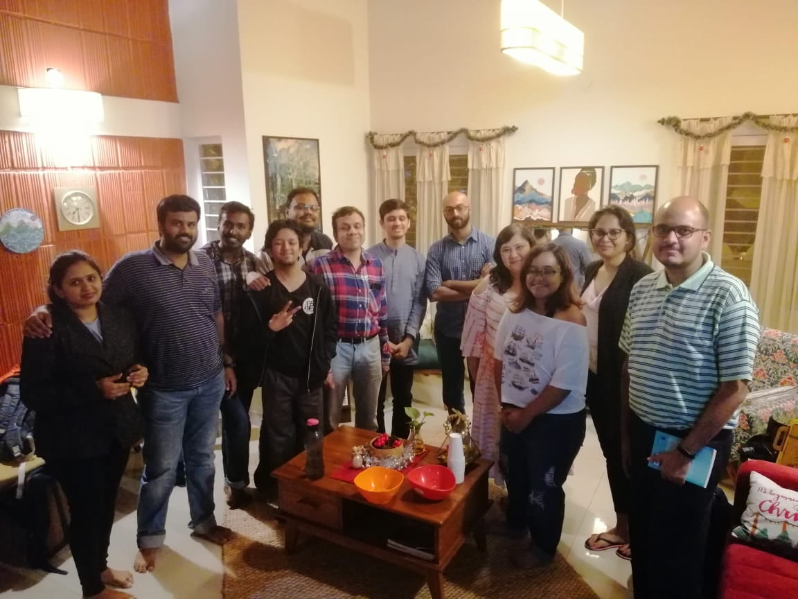

This was a special meetup for a couple of reasons. 
- This was the first meetup that was conducted at a house rather than at a cafe or a park. And when one of our members, Gayathri, generously offered up her art studio as a venue for our meetup I jumped at the offer. I didn't know how it would go because we'd always relied on snacks and beverages from a cafe. But the place looked beautiful so I didn't think twice and we had a lovely time!
- It was our 25th meetup (quarter century babyyy!)

Anyway, there were 13 people at our 25th meetup on the 22nd of December and this time and I thank you all for coming despite the holiday season! :blush:

And if you'd like to see more of Aanai (that's the art studio)'s works, do check out - http://bit.ly/bbb25_aanai

   

- Mistborn-The Final Empire - https://www.goodreads.com/book/show/68428.The_Final_Empire
- The Righteous Mind - https://www.goodreads.com/book/show/11324722-the-righteous-mind
- Mythos - https://www.goodreads.com/book/show/35074096-mythos
- Heroes - https://www.goodreads.com/book/show/41433634-heroes
- American Gods - https://www.goodreads.com/book/show/30165203-american-gods
- The Color of Magic(Discworld#1) - https://www.goodreads.com/book/show/34497.The_Color_of_Magic
- The Light Fantastic(Discworld#2) - https://www.goodreads.com/book/show/34506.The_Light_Fantastic
- Mort(Discworld#4) - https://www.goodreads.com/book/show/386372.Mort
- Equal Rites(Discworld#3) - https://www.goodreads.com/book/show/34507.Equal_Rites
- A darker shade of magic - https://www.goodreads.com/book/show/22055262-a-darker-shade-of-magic
- The Lies of Locke Lamora - https://www.goodreads.com/book/show/29588376-the-lies-of-locke-lamora
- Pawan the flying accountant - https://www.goodreads.com/book/show/36643047-pawan?
- Percy Jackson - https://www.goodreads.com/series/40736-percy-jackson-and-the-olympians
- The Witcher series - https://www.goodreads.com/series/40911-the-witcher
- Malazan - https://www.goodreads.com/series/43493-malazan-book-of-the-fallen
- The palace of illusions - https://www.goodreads.com/book/show/1774836.The_Palace_of_Illusions
- Fountainhead - https://www.goodreads.com/book/show/2122.The_Fountainhead
- Atlas Shrugged - https://www.goodreads.com/book/show/662.Atlas_Shrugged
- Pride & Prejudice - https://www.goodreads.com/book/show/1885.Pride_and_Prejudice
- The Hungry Tide - https://www.goodreads.com/book/show/4950.The_Hungry_Tide
- Sita - https://www.goodreads.com/en/book/show/18514068
- Half the night is gone - https://www.goodreads.com/en/book/show/40506766
- Arthur Conan Doyle - https://www.goodreads.com/book/show/4947464-complete-works-of-arthur-conan-doyle
- Byomkesh Bakshi stories - https://www.goodreads.com/book/show/5968988-byomkesh-bakshi-stories
- Feluda - https://www.goodreads.com/book/show/244524.The_Complete_Adventures_of_Feluda_Vol_1
- Tenida - https://www.goodreads.com/en/book/show/21530643
- Metamorphosis - https://www.goodreads.com/book/show/485894.The_Metamorphosis
- Tom sawyer - https://www.goodreads.com/book/show/24583.The_Adventures_of_Tom_Sawyer
- Kite Runner - https://www.goodreads.com/book/show/77203.The_Kite_Runner
- Norwegian Wood - https://www.goodreads.com/book/show/11297.Norwegian_Wood
- Manto : Selected Stories - https://www.goodreads.com/book/show/7518598-manto
- Joy in Coorg - https://www.goodreads.com/book/show/43607163-joy-in-coorg
- Darkness - https://www.goodreads.com/book/show/48457862-darkness
- Truck de India - https://www.goodreads.com/book/show/48066403-truck-de-india
- Secular common sense - https://www.goodreads.com/book/show/1743582.Secular_Common_Sense
- The Picture of Dorian Gray - https://www.goodreads.com/book/show/5297.The_Picture_of_Dorian_Gray
- The Strange Case of Dr Jekyll & Mr Hyde - https://www.goodreads.com/book/show/51496.The_Strange_Case_of_Dr_Jekyll_and_Mr_Hyde
- Cosmos - https://www.goodreads.com/book/show/55030.Cosmos
- Why Zebras don't get ulcers - https://www.goodreads.com/book/show/327.Why_Zebras_Don_t_Get_Ulcers
- Phantoms in the Brain - https://www.goodreads.com/book/show/31555.Phantoms_in_the_Brain
- The Greatest Show on the Earth - https://www.goodreads.com/book/show/6117055-the-greatest-show-on-earth
- Re-origin of species (?)
- Lost Transmissions (?)
- THX 1138 - https://www.goodreads.com/book/show/35694519-thx-1138
- Divergent Series - https://www.goodreads.com/series/57530-divergent
- Eleanor Oliphant is completely fine - https://www.goodreads.com/book/show/31434883-eleanor-oliphant-is-completely-fine
- Munnu - https://www.goodreads.com/en/book/show/25394441
- The Nine chambered heart - https://www.goodreads.com/book/show/36396222-the-nine-chambered-heart
- Daura - https://www.goodreads.com/book/show/46016752-daura
- Hippie - https://www.goodreads.com/book/show/39731666-hippie
- Bombay Brides - https://www.goodreads.com/book/show/40041682-bombay-brides
- Women (Charles Bukowski) - https://www.goodreads.com/book/show/38500.Women
- Shantaram - https://www.goodreads.com/book/show/33600.Shantaram
- 2001: A Space Odyssey - https://www.goodreads.com/book/show/70535.2001
- The Left hand of darkness - https://www.goodreads.com/book/show/18423.The_Left_Hand_of_Darkness
- Rendezvous with Rama - https://www.goodreads.com/book/show/112537.Rendezvous_with_Rama
- Exhalation - https://www.goodreads.com/book/show/41160292-exhalation
- The Three-Body Problem - https://www.goodreads.com/book/show/20518872-the-three-body-problem
- The Far Pavilions - https://www.goodreads.com/book/show/10222.The_Far_Pavilions
- Gora - https://www.goodreads.com/book/show/1268541.Gora
- Death Note - https://www.goodreads.com/book/show/13615.Death_Note_Vol_1
- From the corner of his eye - https://www.goodreads.com/book/show/65948.From_the_Corner_of_His_Eye
- Ramona Quimby - https://www.goodreads.com/series/40341-ramona-quimby
- A Firefly in the Dark - https://www.goodreads.com/book/show/39793906-a-firefly-in-the-dark
- Maya's New Husband - https://www.goodreads.com/en/book/show/24284039
- Bombay Duck is a Fish - https://www.goodreads.com/en/book/show/11393736
- Jinnah Often came to our house - https://www.goodreads.com/en/book/show/28673987
- All the lives we have never lived by Anuradha Roy
- Illicit happiness of other people - https://www.goodreads.com/book/show/13707645-the-illicit-happiness-of-other-people
- Serious Men - https://www.goodreads.com/book/show/7628608-serious-men
- Jasmine Days - https://www.goodreads.com/book/show/22668589-mullappoo-niramulla-pakalukal
- Goat Days Benyamin
- Ghachar Ghochar - https://www.goodreads.com/book/show/30267604-ghachar-ghochar
- If it's Monday it must be Madurai - https://www.goodreads.com/book/show/19546759-if-it-s-monday-it-must-be-madurai
- The Legend of Khasak - https://www.goodreads.com/book/show/2623267-khasakkinte-ithihasam
- You beneath your skin - https://www.goodreads.com/en/book/show/47634028
- Accidental Magic - https://www.goodreads.com/book/show/48747212-accidental-magic
- Aithihyamala - https://www.goodreads.com/book/show/10588971-aithihyamala
- The City of Brass - https://www.goodreads.com/book/show/32718027-the-city-of-brass
- Stories of Us: The common man(?)
- Ecology and Equity - https://www.goodreads.com/book/show/1397482.Ecology_and_Equity
- Inside jokes: Using humour to reverse engineer the mind - https://www.goodreads.com/en/book/show/9834730
- House of Leaves - https://www.goodreads.com/book/show/24800.House_of_Leaves
- Six of Crows - https://www.goodreads.com/book/show/23437156-six-of-crows
- Crooked Kingdom - https://www.goodreads.com/book/show/22299763-crooked-kingdom
- A Fine Balance - https://www.goodreads.com/book/show/5211.A_Fine_Balance  

If you're reading any of these and want to tell us about your thoughts, leave them in the comments below :)

Until next year! :wink:



<noscript>Please enable JavaScript to view the <a href="https://disqus.com/?ref_noscript">comments powered by Disqus.</a></noscript>
                            
