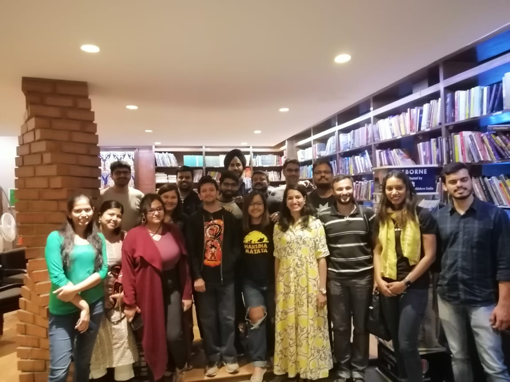

The first Meetup of 2020 and our 26th meetup in all, this one had a nice mixture of newbies and regulars. Amid cheesy chilli pops and coffee, much was discussed about the law, Indian authors and much fiction and non-fiction.
We even had some people flit in and sit in randomly because they saw us discussing books. Another interesting observation was the reference to books discussed in earlier meetups. Bhaunri and Daura for example, were books that were reads from people in a previous meetup and someone else had started reading it this time :) This sort of recommendation-culture is something we've strived to build and it's happening!! :blush: Another recurring book has been The Nine-Chambered Heart. It's been making the rounds for the last few meetups, and I daresay I will be reading it soon as well!

   

The following were the books discussed -

- Cutting for Stone - https://www.goodreads.com/book/show/3591262-cutting-for-stone
- White Chrysanthemum - https://www.goodreads.com/book/show/34701167-white-chrysanthemum
- Daura - https://www.goodreads.com/book/show/46016752-daura
- The Nine Chambered Heart - https://www.goodreads.com/book/show/36396222-the-nine-chambered-heart
- Heroes - https://www.goodreads.com/book/show/41433634-heroes
- The Ascent of Money - https://www.goodreads.com/book/show/2714607-the-ascent-of-money
- Goras and Desis - https://www.goodreads.com/book/show/33122444-goras-and-desis
- Capital in the Twenty-First Century - https://www.goodreads.com/book/show/18736925-capital-in-the-twenty-first-century
- The Far Field - https://www.goodreads.com/book/show/40642323-the-far-field
- The Peculiar Life of A Lonely Postman  - https://www.goodreads.com/book/show/22181611-the-peculiar-life-of-a-lonely-postman
- India's Founding Moment - https://www.goodreads.com/book/show/48161793-india-s-founding-moment
- The Republic of Rhetoric - https://www.goodreads.com/book/show/36295142-republic-of-rhetoric
- The Rosie Project - https://www.goodreads.com/book/show/16181775-the-rosie-project
- A Convenience Store Woman - https://www.goodreads.com/is/book/show/36605525-convenience-store-woman
- The Vegetarian - https://www.goodreads.com/book/show/25489025-the-vegetarian
- The Testament  - https://www.goodreads.com/book/show/5348.The_Testament
- Chowringhee - https://www.goodreads.com/book/show/1074682.Chowringhee
- How to hide an Empire - https://www.goodreads.com/book/show/40121985-how-to-hide-an-empire
- Hangwoman - https://www.goodreads.com/review/show/2346340344
- The Paper Menagerie - https://www.goodreads.com/book/show/24885533-the-paper-menagerie-and-other-stories
- Ghachar Ghochar - https://www.goodreads.com/book/show/30267604-ghachar-ghochar
- The Help - https://www.goodreads.com/book/show/4667024-the-help
- Black Coffee - https://www.goodreads.com/book/show/16352.Black_Coffee
- Murder on The Orient Express - https://www.goodreads.com/book/show/853510.Murder_on_the_Orient_Express
- The Shining - https://www.goodreads.com/book/show/11588.The_Shining
- God of Small Things - https://www.goodreads.com/book/show/9777.The_God_of_Small_Things
- Story of O - https://www.goodreads.com/book/show/40483.Story_of_O
- Maskerade - https://www.goodreads.com/book/show/78876.Maskerade
- Milk Teeth - https://www.goodreads.com/en/book/show/42925495
- Between the Assassinations - https://www.goodreads.com/book/show/5743627-between-the-assassinations
- The Last Wish - https://www.goodreads.com/book/show/40603587-the-last-wish
- The Refrigerator Monologues - https://www.goodreads.com/book/show/32714267-the-refrigerator-monologues
- The Silent Patient - https://www.goodreads.com/book/show/40097951-the-silent-patient
- Don't Run, My Love - https://www.goodreads.com/book/show/36629241-don-t-run-my-love
- The Art of Statistics - https://www.goodreads.com/book/show/43722897-the-art-of-statistics
- The Night Manager - https://www.goodreads.com/book/show/1735330.The_Night_Manager
- Wandering Earth - https://www.goodreads.com/book/show/13554058-the-wandering-earth
- Don't disturb the Dead - https://www.goodreads.com/book/show/34984504-don-t-disturb-the-dead
- An Obedient Father - https://www.goodreads.com/book/show/18377996-an-obedient-father
- Man's Search for Meaning - https://www.goodreads.com/book/show/4069.Man_s_Search_for_Meaning
- Red Badge of Courage - https://www.goodreads.com/book/show/35220.The_Red_Badge_of_Courage
- Eat, Pray, Love - https://www.goodreads.com/book/show/19501.Eat_Pray_Love
- Bhaunri - https://www.goodreads.com/en/book/show/46033194
- Dear Fahrenheit 451 - https://www.goodreads.com/book/show/32768516-dear-fahrenheit-451
- Ladies Coupe - https://www.goodreads.com/book/show/109728.Ladies_Coup_
- The Joy Luck Club - https://www.goodreads.com/book/show/7763.The_Joy_Luck_Club
- The Good Muslim - https://www.goodreads.com/book/show/11331177-the-good-muslim
- Normal People - https://www.goodreads.com/book/show/41057294-normal-people
- The Light Fantastic - https://www.goodreads.com/book/show/34506.The_Light_Fantastic
- The Tattooist of Auschwitz - https://www.goodreads.com/book/show/38359036-the-tattooist-of-auschwitz
- The Graveyard Book - https://www.goodreads.com/book/show/2213661.The_Graveyard_Book
- The Secret of our Success - https://www.goodreads.com/book/show/25761655-the-secret-of-our-success
- The Righteous Mind - https://www.goodreads.com/book/show/11324722-the-righteous-mind

### Other related Mentions 
- :musical_note: The Seen and Unseen - https://seenunseen.in/

Until next time! :blush:



<noscript>Please enable JavaScript to view the <a href="https://disqus.com/?ref_noscript">comments powered by Disqus.</a></noscript>
                            
